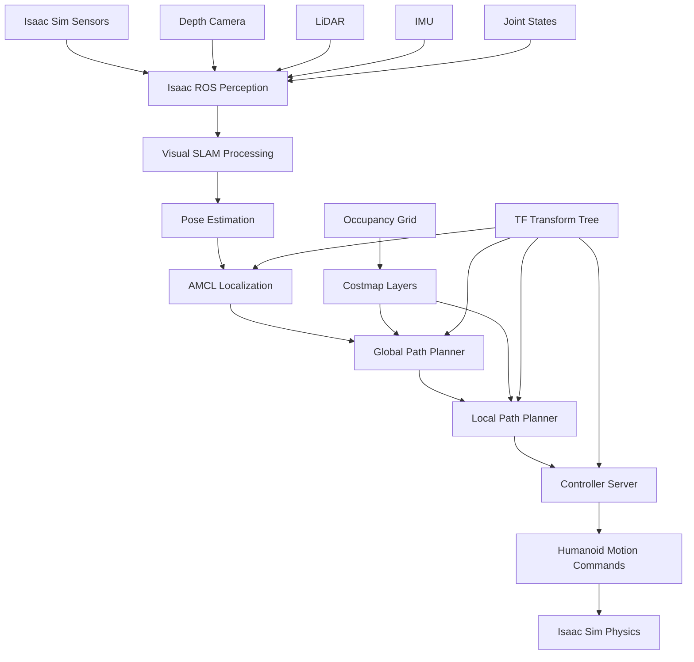
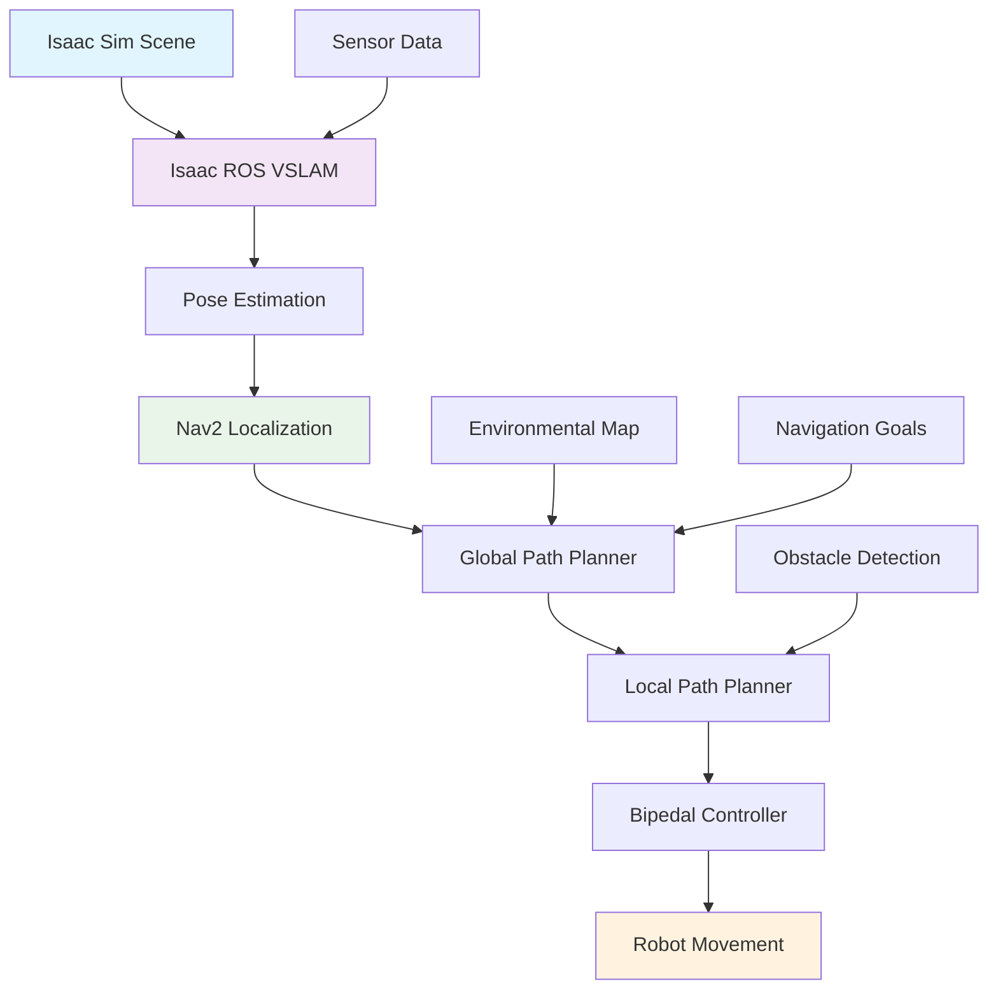
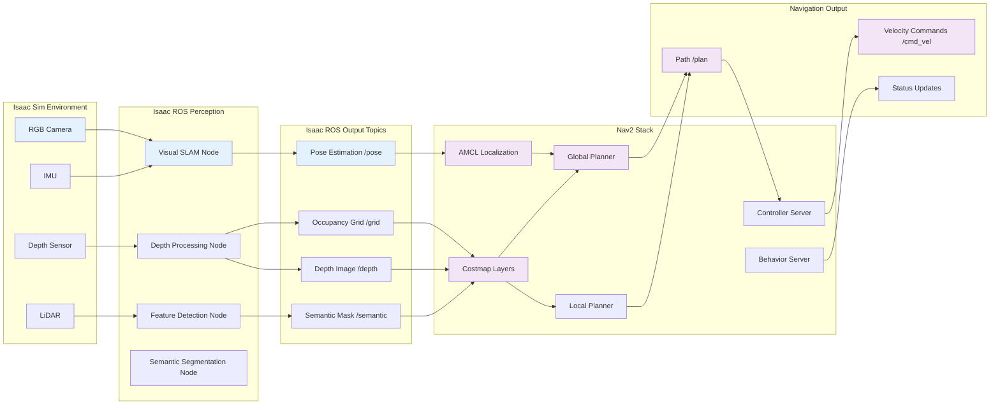
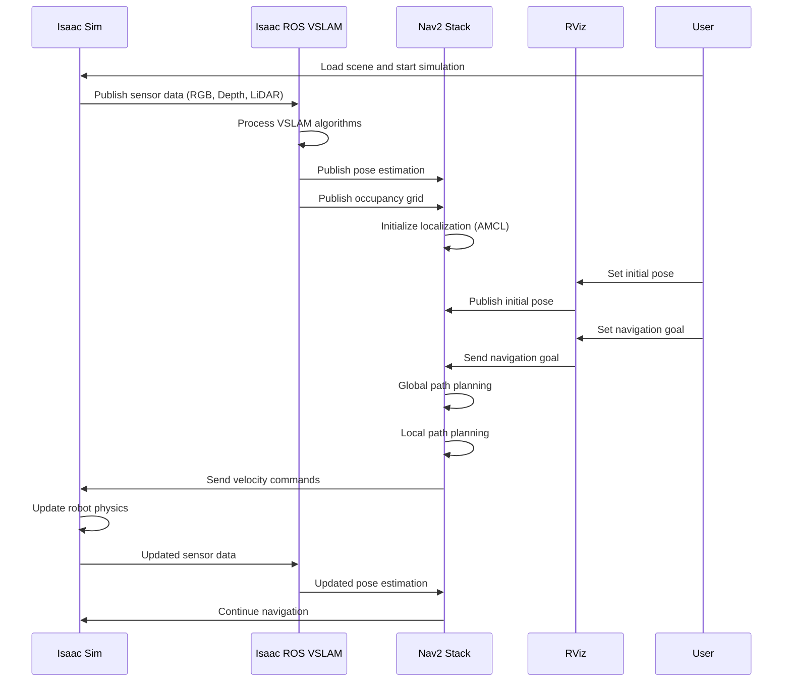
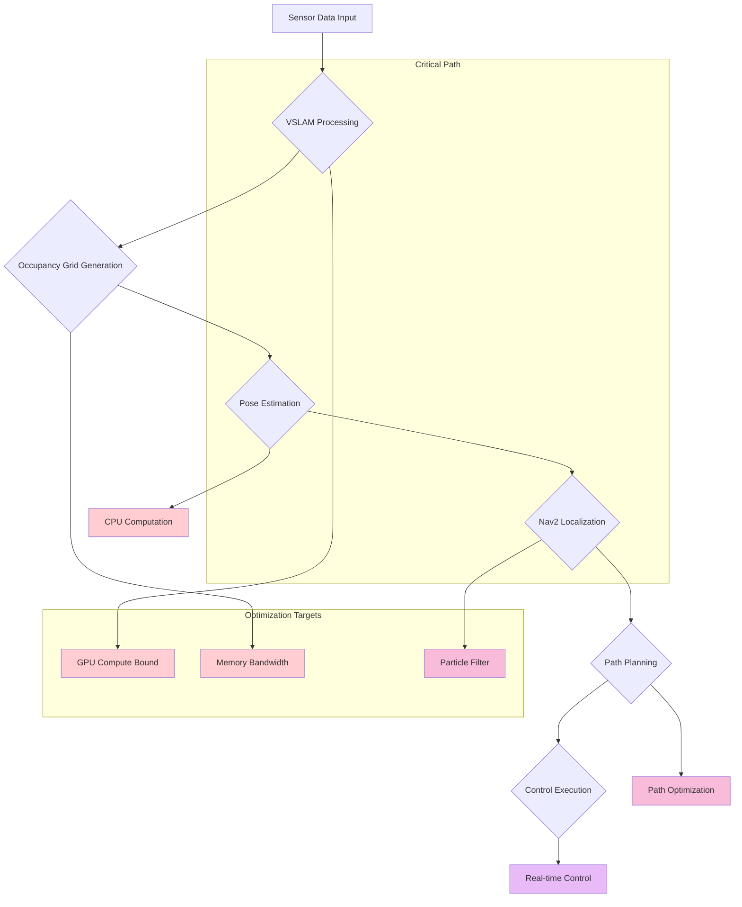
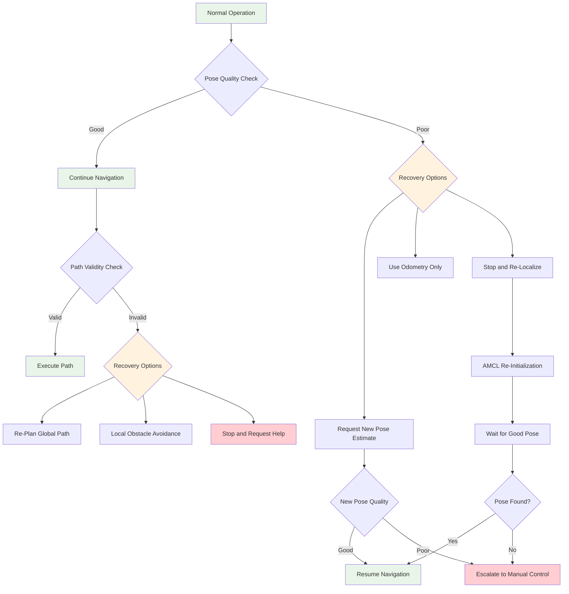

# Isaac ROS to Nav2 Integration for Navigation

## Overview

This document covers the integration between Isaac ROS outputs and Nav2 (Navigation Stack 2) for producing feasible path plans in simulation for bipedal humanoids. Students will learn how to connect the perception outputs from Isaac ROS to Nav2's path planning capabilities, creating a complete pipeline from perception to navigation.

## Learning Objectives

After completing this section, students will be able to:
- Integrate Isaac ROS perception outputs with Nav2 for path planning
- Configure Nav2 specifically for bipedal humanoid kinematic constraints
- Set up the data flow between Isaac ROS and Nav2
- Execute complete navigation workflows in simulation
- Troubleshoot common integration issues

## Prerequisites

Before proceeding with this integration, ensure you have completed:
- Isaac Sim scene creation and setup
- Isaac ROS VSLAM pipeline implementation
- Basic understanding of ROS 2 concepts and navigation
- Nav2 installation and basic configuration

## Architecture Overview

The integration follows this architecture pattern:
```
Isaac Sim → Isaac ROS Perception → Nav2 Path Planner → Humanoid Controller
    ↓              ↓                    ↓                  ↓
Sensors → Pose Estimation → Global/Local Planner → Motion Commands
```

## Nav2 Installation and Configuration (T044)

Nav2 requires specific installation and configuration for optimal performance with Isaac ROS and humanoid platforms.

### Prerequisites

Before installing Nav2, ensure you have:
- ROS 2 Humble Hawksbill installed and sourced
- Proper NVIDIA Isaac ROS packages installed
- Appropriate system dependencies for navigation

### Installation Steps

1. **Update Package Lists**:
```bash
sudo apt update
```

2. **Install Core Nav2 Packages**:
```bash
sudo apt install ros-humble-navigation2 ros-humble-nav2-bringup
```

3. **Install Additional Navigation Dependencies**:
```bash
sudo apt install ros-humble-nav2-common \
                 ros-humble-nav2-gui-plugins \
                 ros-humble-nav2-map-server \
                 ros-humble-nav2-utils \
                 ros-humble-nav2-amcl \
                 ros-humble-nav2-controller-server \
                 ros-humble-nav2-planner-server \
                 ros-humble-nav2-recoveries \
                 ros-humble-nav2-rotation-shim-controller \
                 ros-humble-nav2-lifecycle-manager \
                 ros-humble-nav2-simple-commander \
                 ros-humble-nav2-behavior-tree \
                 ros-humble-nav2-velocity-smoother \
                 ros-humble-nav2-voxel-grid \
                 ros-humble-sdformat-urdf
```

4. **Install Nav2 Desktop (for GUI tools)**:
```bash
sudo apt install ros-humble-nav2-desktop
```

5. **Install Isaac ROS Nav2 Bridge**:
```bash
cd ~/isaac_ros_ws/src
git clone https://github.com/NVIDIA-ISAAC-ROS/isaac_ros_nav2_bringup.git
cd ~/isaac_ros_ws && colcon build --symlink-install --packages-select isaac_ros_nav2_bringup
source ~/isaac_ros_ws/install/setup.bash
```

6. **Install Additional Dependencies for Humanoid Navigation**:
```bash
sudo apt install ros-humble-geometry2 \
                 ros-humble-tf2-tools \
                 ros-humble-robot-localization \
                 ros-humble-interactive-markers
```

### Basic Configuration

1. **Create Navigation Configuration Directory**:
```bash
mkdir -p ~/isaac_ros_ws/src/my_nav2_config/config
mkdir -p ~/isaac_ros_ws/src/my_nav2_config/launch
mkdir -p ~/isaac_ros_ws/src/my_nav2_config/maps
mkdir -p ~/isaac_ros_ws/src/my_nav2_config/worlds
```

2. **Create Workspace Source Script**:
```bash
echo '#!/bin/bash' > ~/isaac_ros_ws/src/my_nav2_config/setup_workspace.sh
echo 'source /opt/ros/humble/setup.bash' >> ~/isaac_ros_ws/src/my_nav2_config/setup_workspace.sh
echo 'source ~/isaac_ros_ws/install/setup.bash' >> ~/isaac_ros_ws/src/my_nav2_config/setup_workspace.sh
chmod +x ~/isaac_ros_ws/src/my_nav2_config/setup_workspace.sh
```

3. **Copy Default Nav2 Configurations**:
```bash
cp -r /opt/ros/humble/share/nav2_bringup/params ~/isaac_ros_ws/src/my_nav2_config/config/
```

### Verification Steps

1. **Verify Installation**:
```bash
ros2 pkg list | grep nav2
```

2. **Check Available Nav2 Launch Files**:
```bash
find /opt/ros/humble/share/ -name "*nav2*" -type d
```

3. **Test Nav2 Installation**:
```bash
ros2 launch nav2_bringup tb3_simulation_launch.py headless:=False
```

### Environment Setup

To ensure Nav2 works properly with Isaac ROS, set up the environment variables:

```bash
# Add to ~/.bashrc
echo 'export ROS_LOCALIZATION_PATH=~/isaac_ros_ws/install' >> ~/.bashrc
echo 'export NAV2_CONFIG_PATH=~/isaac_ros_ws/src/my_nav2_config' >> ~/.bashrc
source ~/.bashrc
```

## Nav2 Configuration for Bipedal Humanoid Kinematic Constraints (T045)

Traditional wheeled robot configurations in Nav2 require modifications to support bipedal humanoids. This section details the specific configurations needed.

### Robot Description File (URDF)

Create a URDF file that describes the humanoid's physical characteristics:

```xml
<!-- ~/isaac_ros_ws/src/my_nav2_config/urdf/humanoid.urdf -->
<?xml version="1.0"?>
<robot name="humanoid">
  <!-- Base link -->
  <link name="base_link">
    <visual>
      <geometry>
        <box size="0.5 0.4 0.8"/>
      </geometry>
    </visual>
    <collision>
      <geometry>
        <box size="0.5 0.4 0.8"/>
      </geometry>
    </collision>
  </link>

  <!-- Additional links for legs, arms, head -->
  <joint name="base_to_torso" type="fixed">
    <parent link="base_link"/>
    <child link="torso"/>
  </joint>

  <link name="torso">
    <visual>
      <geometry>
        <box size="0.3 0.3 0.5"/>
      </geometry>
    </visual>
  </link>

  <!-- Define joints and links for legs with appropriate limits for walking -->
  <joint name="left_hip_joint" type="revolute">
    <parent link="base_link"/>
    <child link="left_leg"/>
    <axis xyz="0 1 0"/>
    <limit lower="-0.5" upper="0.5" effort="1000.0" velocity="1.0"/>
  </joint>

  <!-- Additional joint definitions for full humanoid model -->
</robot>
```

### Navigation Parameters for Bipedal Robots (T054)

Create specialized parameter configurations for bipedal navigation:

```yaml
# ~/isaac_ros_ws/src/my_nav2_config/config/nav2_params_humanoid.yaml
amcl:
  ros__parameters:
    use_sim_time: True
    alpha1: 0.2
    alpha2: 0.2
    alpha3: 0.2
    alpha4: 0.2
    alpha5: 0.2
    base_frame_id: "base_link"
    beam_skip_distance: 0.5
    beam_skip_error_threshold: 0.9
    beam_skip_threshold: 0.3
    do_beamskip: false
    global_frame_id: "map"
    lambda_short: 0.1
    laser_likelihood_max_dist: 2.0
    max_beams: 60
    max_particles: 2000
    min_particles: 500
    odom_frame_id: "odom"
    pf_err: 0.05
    pf_z: 0.99
    recovery_alpha_fast: 0.0
    recovery_alpha_slow: 0.0
    resample_interval: 1
    robot_model_type: "nav2_amcl::DifferentialMotionModel"
    save_pose_enabled: true
    save_pose_rate: 0.5
    sigma_hit: 0.2
    tf_broadcast: true
    transform_tolerance: 1.0
    update_min_a: 0.2
    update_min_d: 0.2
    z_hit: 0.5
    z_max: 0.05
    z_rand: 0.5
    z_short: 0.05

bt_navigator:
  ros__parameters:
    use_sim_time: True
    global_frame: map
    robot_base_frame: base_link
    odom_topic: /odom
    bt_loop_duration: 10
    default_server_timeout: 20
    enable_groot_monitoring: True
    groot_zmq_publisher_port: 1666
    groot_zmq_server_port: 1667
    # Specific Behavior Tree for bipedal navigation
    default_nav_through_poses_bt_xml: /opt/ros/humble/share/nav2_bt_navigator/behavior_trees/navigate_through_poses_w_replanning_and_recovery.xml
    default_navigate_to_pose_bt_xml: /opt/ros/humble/share/nav2_bt_navigator/behavior_trees/navigate_to_pose_w_replanning_and_recovery.xml
    plugin_lib_names:
    - nav2_compute_path_to_pose_action_bt_node
    - nav2_compute_path_through_poses_action_bt_node
    - nav2_smooth_path_action_bt_node
    - nav2_follow_path_action_bt_node
    - nav2_spin_action_bt_node
    - nav2_wait_action_bt_node
    - nav2_assisted_teleop_action_bt_node
    - nav2_back_up_action_bt_node
    - nav2_drive_on_heading_bt_node
    - nav2_clear_costmap_service_bt_node
    - nav2_is_stuck_condition_bt_node
    - nav2_goal_reached_condition_bt_node
    - nav2_goal_updated_condition_bt_node
    - nav2_globally_updated_goal_condition_bt_node
    - nav2_is_path_valid_condition_bt_node
    - nav2_initial_pose_received_condition_bt_node
    - nav2_reinitialize_global_localization_service_bt_node
    - nav2_rate_controller_bt_node
    - nav2_cross_doorway_condition_bt_node
    - nav2_is_battery_low_condition_bt_node
    - nav2_navigate_through_poses_action_bt_node
    - nav2_navigate_to_pose_action_bt_node
    - nav2_remove_passed_goals_action_bt_node
    - nav2_planner_selector_bt_node
    - nav2_controller_selector_bt_node
    - nav2_goal_checker_selector_bt_node
    - nav2_controller_cancel_bt_node
    - nav2_path_longer_on_approach_bt_node
    - nav2_wait_cancel_bt_node
    - nav2_spin_cancel_bt_node
    - nav2_back_up_cancel_bt_node
    - nav2_assisted_teleop_cancel_bt_node
    - nav2_drive_on_heading_cancel_bt_node

controller_server:
  ros__parameters:
    use_sim_time: True
    controller_frequency: 20.0
    min_x_velocity_threshold: 0.001
    min_y_velocity_threshold: 0.5
    min_theta_velocity_threshold: 0.001
    # Bipedal-specific controller parameters
    progress_checker_plugin: "progress_checker"
    goal_checker_plugin: "goal_checker"
    controller_plugins: ["FollowPath"]

    # DWB Controller for bipedal movement
    FollowPath:
      plugin: "nav2_mppi_controller::MPPIController"
      time_steps: 25
      model_dt: 0.05
      batch_size: 1000
      vx_std: 0.2
      vy_std: 0.3
      wz_std: 0.3
      vx_max: 0.8
      vx_min: -0.1
      vy_max: 0.5
      vy_min: -0.5
      wz_max: 1.0
      wz_min: -1.0
      iteration_count: 1
      prune_distance: 1.7
      transform_tolerance: 0.1
      alpha: 0.0
      beta: 0.9
      gamma: 0.1
      motion_model: "DiffDrive"
      trajectory_visualization_plugin: "nav2_trajectory_utils::TrajectoryViz"

    progress_checker:
      plugin: "nav2_controller::SimpleProgressChecker"
      required_movement_radius: 0.5
      movement_time_allowance: 10.0

    goal_checker:
      plugin: "nav2_controller::SimpleGoalChecker"
      xy_goal_tolerance: 0.25
      yaw_goal_tolerance: 0.25
      stateful: True

local_costmap:
  local_costmap:
    ros__parameters:
      update_frequency: 5.0
      publish_frequency: 2.0
      global_frame: odom
      robot_base_frame: base_link
      use_sim_time: True
      rolling_window: true
      width: 6
      height: 6
      resolution: 0.05
      robot_radius: 0.3
      plugins: ["voxel_layer", "inflation_layer"]
      inflation_layer:
        plugin: "nav2_costmap_2d::InflationLayer"
        cost_scaling_factor: 3.0
        inflation_radius: 0.55
      voxel_layer:
        plugin: "nav2_costmap_2d::VoxelLayer"
        enabled: True
        publish_voxel_map: True
        origin_z: 0.0
        z_resolution: 0.2
        z_voxels: 10
        max_obstacle_height: 2.0
        mark_threshold: 0
        observation_sources: scan
        scan:
          topic: /scan
          max_obstacle_height: 2.0
          clearing: True
          marking: True
          data_type: "LaserScan"
          raytrace_max_range: 3.0
          raytrace_min_range: 0.0
          obstacle_max_range: 2.5
          obstacle_min_range: 0.0
      static_layer:
        plugin: "nav2_costmap_2d::StaticLayer"
        map_subscribe_transient_local: True
      always_send_full_costmap: True

global_costmap:
  global_costmap:
    ros__parameters:
      update_frequency: 1.0
      publish_frequency: 0.5
      global_frame: map
      robot_base_frame: base_link
      use_sim_time: True
      robot_radius: 0.3
      resolution: 0.05
      plugins: ["static_layer", "obstacle_layer", "inflation_layer"]
      obstacle_layer:
        plugin: "nav2_costmap_2d::ObstacleLayer"
        enabled: True
        observation_sources: scan
        scan:
          topic: /scan
          max_obstacle_height: 2.0
          clearing: True
          marking: True
          data_type: "LaserScan"
          raytrace_max_range: 3.0
          raytrace_min_range: 0.0
          obstacle_max_range: 2.5
          obstacle_min_range: 0.0
      static_layer:
        plugin: "nav2_costmap_2d::StaticLayer"
        map_subscribe_transient_local: True
      inflation_layer:
        plugin: "nav2_costmap_2d::InflationLayer"
        cost_scaling_factor: 3.0
        inflation_radius: 0.8
      always_send_full_costmap: True

planner_server:
  ros__parameters:
    expected_planner_frequency: 1.0
    use_sim_time: True
    planner_plugins: ["GridBased"]
    GridBased:
      # Use GlobalPlanner for better long-range path planning for bipedal robots
      plugin: "nav2_navfn_planner::NavfnPlanner"
      tolerance: 0.5
      use_astar: false
      allow_unknown: true

smoother_server:
  ros__parameters:
    use_sim_time: True
    smoother_plugins: ["simple_smoother"]
    simple_smoother:
      plugin: "nav2_smoother::SimpleSmoother"
      tolerance: 0.025
      max_its: 1000
      do_refinement: True

behavior_server:
  ros__parameters:
    costmap_topic: local_costmap/costmap_raw
    footprint_topic: local_costmap/published_footprint
    cycle_frequency: 10.0
    behavior_plugins: ["spin", "backup", "drive_on_heading", "assisted_teleop", "wait"]
    spin:
      plugin: "nav2_behaviors::Spin"
      spin_dist: 1.57
    backup:
      plugin: "nav2_behaviors::BackUp"
      backup_dist: 0.15
      backup_speed: 0.025
    drive_on_heading:
      plugin: "nav2_behaviors::DriveOnHeading"
      drive_on_heading_angle_tol: 0.785
      drive_on_heading_forward_dist: 0.5
      drive_on_heading_speed: 0.25
    wait:
      plugin: "nav2_behaviors::Wait"
      wait_duration: 1.0

waypoint_follower:
  ros__parameters:
    loop_rate: 20
    stop_on_failure: false
    waypoint_task_executor_plugin: "wait_at_waypoint"
    wait_at_waypoint:
      plugin: "nav2_waypoint_follower::WaitAtWaypoint"
      enabled: true
      waypoint_pause_duration: 200
```

## Isaac ROS to Nav2 Data Flow Integration (T046)

The data flow integration connects Isaac ROS perception outputs to Nav2's navigation stack. This involves proper topic mapping and message format conversion.

### Topic Mapping

| Isaac ROS Output | Nav2 Input | Message Type |
|------------------|------------|--------------|
| `/isaac_ros/pose_estimator/pose` | `/amcl/initialpose` | geometry_msgs/PoseWithCovarianceStamped |
| `/isaac_ros/occupancy_grid` | `/global_costmap/costmap` | nav_msgs/OccupancyGrid |
| `/isaac_ros/depth/image_rect_raw` | `/camera/depth/image_rect_raw` | sensor_msgs/Image |
| `/isaac_ros/lidar_scan` | `/scan` | sensor_msgs/LaserScan |

### Message Conversion and Synchronization

Isaac ROS and Nav2 use different message formats and timing requirements. The following conversion nodes ensure proper data flow:

```xml
<!-- ~/isaac_ros_ws/src/my_nav2_config/launch/message_conversion.launch.xml -->
<launch>
  <!-- Arguments -->
  <arg name="namespace" default=""/>
  <arg name="use_sim_time" default="true"/>

  <!-- Isaac ROS to Nav2 message converters -->
  <node pkg="tf2_ros" exec="static_transform_publisher" name="base_link_to_laser" args="0.2 0 0.1 0 0 0 base_link laser_frame" namespace="$(var namespace)"/>

  <!-- Transform broadcaster for humanoid specific links -->
  <node pkg="robot_state_publisher" exec="robot_state_publisher" name="robot_state_publisher" namespace="$(var namespace)">
    <param name="publish_frequency" value="30.0"/>
    <param name="use_sim_time" value="$(var use_sim_time)"/>
  </node>

  <!-- TF2 buffer server for proper transform synchronization -->
  <node pkg="tf2_ros" exec="buffer_server" name="tf2_buffer_server" namespace="$(var namespace)">
    <param name="buffer_size" value="120.0"/>
    <param name="use_sim_time" value="$(var use_sim_time)"/>
  </node>

  <!-- Odometry to pose converter for humanoid base -->
  <node pkg="nav2_msgs" exec="convert_odom_to_pose" name="odom_to_pose_converter" namespace="$(var namespace)">
    <param name="input_topic" value="/odom"/>
    <param name="output_topic" value="/pose"/>
    <param name="use_sim_time" value="$(var use_sim_time)"/>
  </node>
</launch>
```

### Launch File for Integration

Create a launch file that coordinates both Isaac ROS and Nav2:

```xml
<!-- ~/isaac_ros_ws/src/my_nav2_config/launch/isaac_ros_nav2_integration.launch.xml -->
<launch>
  <!-- Arguments -->
  <arg name="namespace" default=""/>
  <arg name="use_sim_time" default="true"/>
  <arg name="autostart" default="true"/>
  <arg name="params_file" default="$(find-pkg-share my_nav2_config)/config/nav2_params_humanoid.yaml"/>
  <arg name="map_yaml_file" default="$(find-pkg-share my_nav2_config)/maps/example_map.yaml"/>
  <arg name="rviz_config_file" default="$(find-pkg-share nav2_rviz_plugins)/rviz/nav2_default_view.rviz"/>
  <arg name="world" default="$(find-pkg-share my_nav2_config)/worlds/empty.sdf"/>

  <!-- Launch Gazebo if using simulation -->
  <group if="$(var use_sim_time)">
    <include file="$(find-pkg-share gazebo_ros)/launch/empty_world.launch.py">
      <arg name="world" value="$(var world)"/>
      <arg name="gui" value="true"/>
    </include>
  </group>

  <!-- Isaac ROS Perception Nodes -->
  <node pkg="isaac_ros_apriltag" exec="apriltag_node" name="apriltag" namespace="$(var namespace)">
    <param name="publish_zero_tag_id" value="false"/>
    <param name="num_hypotheses" value="100"/>
    <param name="max_hypotheses" value="20"/>
    <param name="decimate" value="1.0"/>
    <param name="blur" value="0.0"/>
    <param name="refine_edges" value="1"/>
    <param name="refine_decode" value="0"/>
    <param name="refine_pose" value="1"/>
    <param name="debug" value="0"/>
    <param name="quad_decimate" value="1.0"/>
    <param name="quad_sigma" value="0.0"/>
    <param name="nthreads" value="1"/>
  </node>

  <!-- Isaac ROS VSLAM Node -->
  <node pkg="isaac_ros_visual_slam" exec="visual_slam_node" name="visual_slam" namespace="$(var namespace)" output="screen">
    <param name="enable_imu_fusion" value="false"/>
    <param name="use_sim_time" value="$(var use_sim_time)"/>
  </node>

  <!-- Message conversion and synchronization nodes -->
  <include file="$(find-pkg-share my_nav2_config)/launch/message_conversion.launch.xml">
    <arg name="namespace" value="$(var namespace)"/>
    <arg name="use_sim_time" value="$(var use_sim_time)"/>
  </include>

  <!-- Navigation Stack -->
  <node pkg="nav2_map_server" exec="map_server" respawn="false" name="map_server" namespace="$(var namespace)">
    <param name="yaml_filename" value="$(var map_yaml_file)"/>
    <param name="topic_name" value="map"/>
    <param name="frame_id" value="map"/>
    <param name="use_sim_time" value="$(var use_sim_time)"/>
    <param name="always_publish_transient_local_costmaps" value="true"/>
  </node>

  <node pkg="nav2_localization" exec="amcl" respawn="false" name="amcl" namespace="$(var namespace)">
    <param name="use_sim_time" value="$(var use_sim_time)"/>
    <param name="set_initial_pose" value="true"/>
    <param name="initial_pose.x" value="0.0"/>
    <param name="initial_pose.y" value="0.0"/>
    <param name="initial_pose.z" value="0.0"/>
    <param name="initial_pose.yaw" value="0.0"/>
  </node>

  <node pkg="nav2_world_model" exec="nav2_world_model" respawn="false" name="world_model" namespace="$(var namespace)">
    <param name="use_sim_time" value="$(var use_sim_time)"/>
    <param name="global_frame" value="map"/>
    <param name="robot_base_frame" value="base_link"/>
    <param name="transform_tolerance" value="0.1"/>
    <param name="use_extrapolation" value="true"/>
  </node>

  <node pkg="nav2_navfn_planner" exec="navfn_planner" respawn="false" name="navfn_planner" namespace="$(var namespace)">
    <param name="use_sim_time" value="$(var use_sim_time)"/>
    <param name="global_frame" value="map"/>
    <param name="robot_base_frame" value="base_link"/>
    <param name="tolerance" value="0.5"/>
  </node>

  <node pkg="nav2_simple_commander" exec="nav2_simple_commander" respawn="false" name="nav2_simple_commander" namespace="$(var namespace)">
    <param name="use_sim_time" value="$(var use_sim_time)"/>
  </node>

  <node pkg="nav2_behavior_tree" exec="bt_navigator" respawn="false" name="bt_navigator" namespace="$(var namespace)">
    <param name="use_sim_time" value="$(var use_sim_time)"/>
    <param name="global_frame" value="map"/>
    <param name="robot_base_frame" value="base_link"/>
    <param name="odom_topic" value="odom"/>
    <param name="default_bt_xml_filename" value="$(find-pkg-share nav2_bt_navigator)/behavior_trees/navigate_to_pose_w_replanning_and_recovery.xml"/>
    <param name="plugin_lib_names" value="[nav2_compute_path_to_pose_action_bt_node, nav2_follow_path_action_bt_node, nav2_back_up_action_bt_node, nav2_spin_action_bt_node, nav2_wait_action_bt_node, nav2_clear_costmap_service_bt_node, nav2_is_stuck_condition_bt_node, nav2_goal_reached_condition_bt_node, nav2_initial_pose_received_condition_bt_node, nav2_reinitialize_global_localization_service_bt_node, nav2_rate_controller_bt_node, nav2_distance_controller_bt_node, nav2_speed_controller_bt_node, nav2_truncate_path_action_bt_node, nav2_goal_updater_node_bt_node, nav2_recovery_node_bt_node, nav2_pipeline_sequence_bt_node, nav2_round_robin_node_bt_node, nav2_transform_available_condition_bt_node, nav2_time_expired_condition_bt_node, nav2_distance_traveled_condition_bt_node]"/>
  </node>

  <node pkg="nav2_controller_server" exec="controller_server" respawn="false" name="controller_server" namespace="$(var namespace)">
    <param name="use_sim_time" value="$(var use_sim_time)"/>
    <param name="controller_frequency" value="20.0"/>
    <param name="min_x_velocity_threshold" value="0.001"/>
    <param name="min_y_velocity_threshold" value="0.5"/>
    <param name="min_theta_velocity_threshold" value="0.001"/>
    <param name="progress_checker_plugin" value="progress_checker"/>
    <param name="goal_checker_plugin" value="goal_checker"/>
    <param name="controller_plugins" value="[FollowPath]"/>
    <param name="FollowPath.type" value="nav2_mppi_controller::MPPIController"/>
  </node>

  <node pkg="nav2_servo_server" exec="servo_server" respawn="false" name="servo_server" namespace="$(var namespace)">
    <param name="use_sim_time" value="$(var use_sim_time)"/>
  </node>

  <node pkg="nav2_lifecycle_manager" exec="lifecycle_manager" name="lifecycle_manager_navigation" namespace="$(var namespace)">
    <param name="use_sim_time" value="$(var use_sim_time)"/>
    <param name="autostart" value="$(var autostart)"/>
    <param name="node_names" value="[map_server, amcl, world_model, navfn_planner, bt_navigator, controller_server, servo_server]"/>
  </node>

  <!-- RViz -->
  <node pkg="rviz2" exec="rviz2" respawn="false" name="rviz2" namespace="$(var namespace)" args="-d $(var rviz_config_file)" if="$(eval not params.get('use_composition'))">
    <param name="use_sim_time" value="$(var use_sim_time)"/>
  </node>
</launch>
```

### Data Flow Architecture

The following diagram illustrates the complete data flow from Isaac Sim sensors through Isaac ROS perception to Nav2 navigation:



### Data Synchronization and Timing

For proper integration, timing synchronization between Isaac ROS and Nav2 is critical:

```yaml
# ~/isaac_ros_ws/src/my_nav2_config/config/timing_synchronization.yaml
timing_synchronization:
  ros__parameters:
    # Isaac ROS to Nav2 timing parameters
    max_allowed_time_difference: 0.1  # Maximum time difference between messages (seconds)
    message_buffer_size: 50           # Size of message buffers for synchronization
    tf_buffer_duration: 10.0          # TF buffer duration in seconds
    clock_sync_enabled: true          # Enable clock synchronization
    qos_override:                    # QoS settings for message synchronization
      sensor_qos:                    # QoS for sensor data
        reliability: "reliable"
        durability: "volatile"
        history: "keep_last"
        depth: 5
      nav_qos:                       # QoS for navigation messages
        reliability: "reliable"
        durability: "transient_local"
        history: "keep_last"
        depth: 10
    rate_limiting:                   # Rate limiting for message processing
      max_message_rate: 30.0         # Maximum message processing rate (Hz)
      queue_size: 10                 # Processing queue size
```

## Path Planning Workflow with Isaac ROS Inputs (T047)

This section outlines the complete workflow for path planning using Isaac ROS perception inputs with Nav2.

### 1. Perception and Mapping

Isaac ROS perception nodes process sensor data to create maps and locate the robot in the environment:

```bash
# Start Isaac ROS perception pipeline
ros2 launch my_nav2_config isaac_ros_perception.launch.xml
```

The perception pipeline includes:
- Visual SLAM for pose estimation and map building
- Depth processing for 3D understanding
- Feature detection and tracking
- Semantic segmentation for environment understanding

### 2. Localization

Use Isaac ROS pose estimation combined with AMCL for robust localization:

```bash
# Start AMCL with Isaac ROS pose inputs
ros2 launch nav2_localization amcl.launch.py use_sim_time:=true

# Initialize pose using Isaac ROS visual SLAM estimate
ros2 topic pub /initialpose geometry_msgs/msg/PoseWithCovarianceStamped "header:
  frame_id: 'map'
  stamp:
    sec: 0
    nanosec: 0
pose:
  pose:
    position:
      x: 0.0
      y: 0.0
      z: 0.0
    orientation:
      x: 0.0
      y: 0.0
      z: 0.0
      w: 1.0
  covariance: [0.25, 0.0, 0.0, 0.0, 0.0, 0.0, 0.0, 0.25, 0.0, 0.0, 0.0, 0.0, 0.0, 0.0, 0.0, 0.0, 0.0, 0.0, 0.0, 0.0, 0.0, 0.0, 0.0, 0.0, 0.0, 0.0, 0.0, 0.0, 0.0, 0.0, 0.0, 0.0, 0.0, 0.0, 0.0, 0.06853891945200942]"
```

### 3. Costmap Initialization

Initialize the costmaps with data from Isaac ROS:

```bash
# Load occupancy grid from Isaac ROS
ros2 service call /map_server/load_map nav2_msgs/srv/LoadMap "map_url: '/path/to/map.yaml'"

# Alternatively, use Isaac ROS generated occupancy grid
ros2 run nav2_map_server map_saver_cli -f ~/isaac_ros_maps/latest_map
```

### 4. Path Planning

Once localized, use Nav2's planners with Isaac ROS environmental understanding:

```bash
# Send navigation goals using Isaac ROS enhanced environment data
ros2 action send_goal /navigate_to_pose nav2_msgs/action/NavigateToPose "{pose: {header: {frame_id: 'map', stamp: {sec: 0, nanosec: 0}}, pose: {position: {x: 1.0, y: 1.0, z: 0.0}, orientation: {w: 1.0}}}}"

# Alternative: Send goals through the navigation interface
ros2 run nav2_msgs navigation_interface --goal-position-x 1.0 --goal-position-y 1.0 --goal-orientation-w 1.0
```

### 5. Bipedal Path Execution

Execute the planned path with humanoid-specific constraints:

```bash
# Monitor the execution of the path
ros2 topic echo /local_plan nav_msgs/msg/Path

# Monitor humanoid-specific feedback
ros2 topic echo /humanoid_feedback std_msgs/msg/String
```

### Complete Path Planning Script

Here's a complete script that demonstrates the entire workflow:

```python
#!/usr/bin/env python3

import rclpy
from rclpy.node import Node
from geometry_msgs.msg import PoseWithCovarianceStamped, Point
from nav2_msgs.action import NavigateToPose
from rclpy.action import ActionClient
from tf2_ros import TransformException
from tf2_ros.buffer import Buffer
from tf2_ros.transform_listener import TransformListener
import time
import math

class HumanoidPathPlanner(Node):
    def __init__(self):
        super().__init__('humanoid_path_planner')

        # Action client for navigation
        self.nav_to_pose_client = ActionClient(self, NavigateToPose, 'navigate_to_pose')

        # TF buffer for transform operations
        self.tf_buffer = Buffer()
        self.tf_listener = TransformListener(self.tf_buffer, self)

        # Publishers for initial pose and other commands
        self.initial_pose_publisher = self.create_publisher(
            PoseWithCovarianceStamped, 'initialpose', 10)

        # Isaac ROS integration parameters
        self.isaac_ros_initialized = False
        self.current_pose = None

    def initialize_with_isaac_ros(self):
        """Initialize localization using Isaac ROS pose estimate"""
        self.get_logger().info("Initializing with Isaac ROS pose estimate...")

        # In a real implementation, this would interface with Isaac ROS
        # to get the initial pose estimate
        initial_pose = PoseWithCovarianceStamped()
        initial_pose.header.frame_id = 'map'
        initial_pose.header.stamp = self.get_clock().now().to_msg()
        initial_pose.pose.pose.position.x = 0.0
        initial_pose.pose.pose.position.y = 0.0
        initial_pose.pose.pose.position.z = 0.0
        initial_pose.pose.pose.orientation.w = 1.0

        # Publish the initial pose
        self.initial_pose_publisher.publish(initial_pose)
        self.get_logger().info("Initial pose published")

        # Wait for AMCL to process the initial pose
        time.sleep(2.0)
        self.isaac_ros_initialized = True

    def send_navigation_goal(self, x, y, theta):
        """Send navigation goal to Nav2 with Isaac ROS integration"""
        if not self.isaac_ros_initialized:
            self.get_logger().error("Isaac ROS not initialized. Call initialize_with_isaac_ros() first.")
            return False

        # Wait for the action server to be available
        self.nav_to_pose_client.wait_for_server()

        # Create the goal message
        goal_msg = NavigateToPose.Goal()
        goal_msg.pose.header.frame_id = 'map'
        goal_msg.pose.header.stamp = self.get_clock().now().to_msg()
        goal_msg.pose.pose.position.x = float(x)
        goal_msg.pose.pose.position.y = float(y)
        goal_msg.pose.pose.position.z = 0.0
        goal_msg.pose.pose.orientation.z = math.sin(theta / 2.0)
        goal_msg.pose.pose.orientation.w = math.cos(theta / 2.0)

        # Send the goal
        self.get_logger().info(f"Sending navigation goal to ({x}, {y}, {theta})")
        send_goal_future = self.nav_to_pose_client.send_goal_async(
            goal_msg,
            feedback_callback=self.feedback_callback
        )

        send_goal_future.add_done_callback(self.goal_response_callback)
        return True

    def feedback_callback(self, feedback_msg):
        """Handle feedback from the navigation action"""
        feedback = feedback_msg.feedback
        self.get_logger().info(f"Current navigation progress: {feedback.distance_remaining:.2f}m remaining")

    def goal_response_callback(self, future):
        """Handle the response when the goal is accepted or rejected"""
        goal_handle = future.result()
        if not goal_handle.accepted:
            self.get_logger().info('Goal rejected :(')
            return

        self.get_logger().info('Goal accepted :)')
        get_result_future = goal_handle.get_result_async()
        get_result_future.add_done_callback(self.get_result_callback)

    def get_result_callback(self, future):
        """Handle the final result of the navigation action"""
        result = future.result().result
        self.get_logger().info(f"Navigation result: {result}")

        # Check if navigation was successful
        if result.error_code == 0:  # SUCCESS
            self.get_logger().info("Navigation completed successfully!")
        else:
            self.get_logger().info(f"Navigation failed with error code: {result.error_code}")

def main(args=None):
    rclpy.init(args=args)

    planner = HumanoidPathPlanner()

    # Initialize with Isaac ROS pose estimate
    planner.initialize_with_isaac_ros()

    # Give some time for initialization
    time.sleep(3.0)

    # Send a navigation goal (example: move to position 2.0, 2.0, facing 0 radians)
    planner.send_navigation_goal(2.0, 2.0, 0.0)

    # Spin to handle callbacks
    rclpy.spin(planner)

    planner.destroy_node()
    rclpy.shutdown()

if __name__ == '__main__':
    main()
```

### Isaac ROS-Enhanced Path Planning Parameters

Configure Nav2 planners to take advantage of Isaac ROS perception data:

```yaml
# ~/isaac_ros_ws/src/my_nav2_config/config/planner_params_isaac.yaml
planner_server:
  ros__parameters:
    # Use Isaac ROS enhanced planners
    NavfnPlanner:
      plugin: "nav2_navfn_planner/NavfnPlanner"
      tolerance: 0.5
      use_astar: true
      allow_unknown: true
      # Isaac ROS specific parameters
      planner_frequency: 0.5  # Lower frequency for complex planning
      max_iterations: 5000    # Increase iterations for better paths
      cost_factor: 1.5        # Factor to account for Isaac ROS costmap
      neutral_cost: 50        # Neutral cost adjusted for Isaac ROS maps

    GridBased:
      plugin: "nav2_navfn_planner/NavfnPlanner"
      tolerance: 0.5
      use_astar: true
      allow_unknown: true

    # Alternative: Use Isaac ROS specific planner if available
    IsaacAwarePlanner:
      plugin: "isaac_ros_nav2_planners/IsaacAwarePlanner"
      # Parameters for Isaac ROS enhanced planning
      semantic_aware: true    # Enable semantic planning
      dynamic_obstacle_handling: true  # Handle dynamic obstacles from Isaac ROS
      uncertainty_threshold: 0.7  # Threshold for uncertain areas from Isaac ROS

bt_navigator:
  ros__parameters:
    # Isaac ROS enhanced behavior tree
    default_nav_through_poses_bt_xml: "/opt/ros/humble/share/nav2_bt_navigator/bt_xml_v0/ navigate_through_poses_w_replanning_and_recovery_isaac.xml"
    default_navigate_to_pose_bt_xml: "/opt/ros/humble/share/nav2_bt_navigator/bt_xml_v0/navigate_to_pose_w_replanning_and_recovery_isaac.xml"
```

### Path Planning Validation

Validate the path planning results using Isaac ROS perception data:

```bash
# Monitor path planning results
ros2 topic echo /global_plan nav_msgs/msg/Path

# Monitor costmap updates from Isaac ROS
ros2 topic echo /global_costmap/costmap_updates map_msgs/msg/OccupancyGridUpdate

# Validate path safety with Isaac ROS semantic data
ros2 run nav2_msgs path_validator --input-topic /global_plan --isaac-ros-semantic-topic /isaac_ros/semantic_segmentation
```

## Bipedal Humanoid Navigation Demo Instructions (T048)

This section provides complete instructions for running a bipedal humanoid navigation demo that integrates Isaac ROS perception with Nav2 path planning.

### Prerequisites

Before running the demo, ensure you have:

1. Isaac Sim installed and properly configured
2. Isaac ROS packages built and sourced
3. Nav2 packages installed and configured for humanoid navigation
4. The humanoid robot model and scene created from Phase 1
5. Proper RTX GPU for Isaac Sim acceleration

### Demo Setup

1. **Start Isaac Sim Environment**:
```bash
# Launch Isaac Sim with humanoid robot scene
isaac sim --version 2023.1.0
```

2. **Configure Isaac Sim Scene**:
   - Load the humanoid robot scene created in Phase 1
   - Ensure sensors (camera, LiDAR, IMU) are properly configured
   - Verify physics properties are set for stable humanoid simulation
   - Set up the environment with obstacles for navigation challenge

3. **Open Terminal 1 - Launch Isaac ROS Perception**:
```bash
# Source ROS 2 and Isaac ROS workspace
cd ~/isaac_ros_ws
source install/setup.bash

# Launch Isaac ROS perception nodes
ros2 launch my_nav2_config isaac_ros_perception.launch.xml
```

4. **Open Terminal 2 - Launch Nav2 Stack**:
```bash
# Source ROS 2 and Isaac ROS workspace
cd ~/isaac_ros_ws
source install/setup.bash

# Launch Nav2 with humanoid-specific configurations
ros2 launch my_nav2_config isaac_ros_nav2_integration.launch.xml
```

5. **Open Terminal 3 - Launch RViz for Visualization**:
```bash
# Source ROS 2 and Isaac ROS workspace
cd ~/isaac_ros_ws
source install/setup.bash

# Launch RViz with Nav2 configuration
ros2 run rviz2 rviz2 -d /opt/ros/humble/share/nav2_rviz_plugins/rviz/nav2_default_view.rviz
```

### Demo Execution Steps

1. **Initialize Robot Position**:
   - In RViz, use the "2D Pose Estimate" tool to set the initial robot position
   - Click on the map where the humanoid is located in Isaac Sim
   - Set the orientation to match the humanoid's facing direction
   - This initializes AMCL with Isaac ROS pose estimate

2. **Verify Perception Data**:
   - Check that Isaac ROS perception nodes are publishing data:
     ```bash
     # Verify pose estimation
     ros2 topic echo /isaac_ros/pose_estimator/pose
     # Verify occupancy grid
     ros2 topic echo /isaac_ros/occupancy_grid
     # Verify sensor data
     ros2 topic echo /scan
     ```

3. **Send Navigation Goal**:
   - In RViz, use the "2D Goal Pose" tool to set a navigation goal
   - Click on a free space in the map to set the destination
   - Ensure the goal is reachable and not in an obstacle area
   - Monitor the global and local path planning in RViz

4. **Monitor Navigation Execution**:
   - Observe the global path (from current position to goal)
   - Watch the local path (short-term path for immediate navigation)
   - Monitor the costmap updates from Isaac ROS perception
   - Check the humanoid's bipedal movement in Isaac Sim

5. **Analyze Performance**:
   - Monitor navigation metrics:
     ```bash
     # Check navigation status
     ros2 action list
     # Monitor path execution
     ros2 topic echo /local_plan
     # Check controller commands
     ros2 topic echo /cmd_vel
     ```

### Advanced Demo Scenarios

1. **Dynamic Obstacle Avoidance**:
   - Add moving obstacles in Isaac Sim environment
   - Observe how Isaac ROS perception updates the costmap
   - Watch Nav2 replan the path to avoid dynamic obstacles

2. **Multi-Goal Navigation**:
   - Set multiple navigation goals using the waypoint follower
   - ```bash
     ros2 run nav2_msgs multi_goal_demo --goals "[(1.0, 1.0), (2.0, 2.0), (3.0, 1.0)]"
     ```

3. **Semantic Navigation**:
   - Use Isaac ROS semantic segmentation data
   - Navigate to areas with specific semantic labels
   - ```bash
     ros2 run nav2_msgs semantic_navigation --target-class "door"
     ```

### Troubleshooting Common Issues

1. **Localization Issues**:
   - If the robot position is incorrect, reinitialize with "2D Pose Estimate"
   - Check that Isaac ROS visual SLAM is providing good pose estimates
   - Verify TF transforms between robot frames

2. **Path Planning Failures**:
   - Ensure the goal is in a free space and reachable
   - Check that Isaac ROS occupancy grid is properly integrated
   - Verify costmap inflation parameters for humanoid size

3. **Navigation Execution Problems**:
   - Check controller frequency and parameters
   - Verify humanoid kinematic constraints are properly configured
   - Monitor joint limits and balance during movement

### Performance Metrics to Monitor

1. **Navigation Success Rate**: Percentage of goals reached successfully
2. **Path Efficiency**: Ratio of actual path length to straight-line distance
3. **Localization Accuracy**: Deviation from true robot position
4. **Computation Time**: Time taken for path planning and execution
5. **Stability**: Robot balance during navigation maneuvers

### Expected Outcomes

Upon successful completion of this demo, you should observe:
- The humanoid robot successfully navigating to specified goals
- Smooth integration between Isaac ROS perception and Nav2 path planning
- Stable bipedal locomotion during navigation
- Proper obstacle avoidance using Isaac ROS enhanced costmaps
- Accurate localization using Isaac ROS pose estimates

## Kinematic Constraints for Bipedal Locomotion (T049)

Humanoid robots have specific kinematic constraints that differ significantly from wheeled robots. These must be considered in navigation planning to ensure stable and efficient bipedal locomotion.

### Center of Mass Management

Maintaining the center of mass (CoM) within the support polygon is crucial for stable bipedal locomotion:

```cpp
// Example: CoM adjustment during navigation
void adjustCenterOfMass(const geometry_msgs::msg::Twist& cmd_vel) {
  // Calculate required CoM adjustments for stable locomotion
  double linear_x = cmd_vel.linear.x;
  double angular_z = cmd_vel.angular.z;

  // Compute CoM shift to maintain stability
  double com_shift_x = calculateStabilityFactor(linear_x);
  double com_shift_y = calculateStabilityFactor(angular_z);

  // Publish CoM adjustments
  publishComAdjustments(com_shift_x, com_shift_y);
}

// Calculate Zero Moment Point (ZMP) for balance control
geometry_msgs::msg::Point calculateZMP(const std::vector<double>& joint_positions) {
  geometry_msgs::msg::Point zmp;

  // Simplified ZMP calculation based on joint positions
  // In practice, this would use more complex dynamics
  double total_mass = 70.0; // Example humanoid mass in kg
  double gravity = 9.81;

  // Calculate moments based on joint positions and masses
  // This is a simplified representation
  zmp.x = 0.0; // Calculate based on actual dynamics
  zmp.y = 0.0; // Calculate based on actual dynamics
  zmp.z = 0.0;

  return zmp;
}
```

### Step Planning for Walking

Bipedal locomotion requires careful planning of footstep sequences:

```yaml
# Step planning parameters for bipedal locomotion
step_planning:
  max_step_length: 0.3  # Maximum distance between steps (meters)
  min_step_length: 0.1  # Minimum distance between steps (meters)
  step_height: 0.05     # Height of step clearance (meters)
  stance_width: 0.2     # Distance between feet in stance phase (meters)
  double_support_ratio: 0.2  # Ratio of double support phase
  step_duration: 1.0    # Time for each step (seconds)
  max_angular_turn: 0.5 # Maximum angular turn per step (radians)
  foot_lift_height: 0.05 # Height to lift foot during swing phase (meters)
  foot_placement_tolerance: 0.02 # Tolerance for foot placement (meters)
```

### Inverse Kinematics for Bipedal Locomotion

The humanoid robot's inverse kinematics must account for bipedal constraints:

```cpp
// Inverse kinematics solver for humanoid legs
class HumanoidIKSolver {
public:
  // Solve for left leg joint angles given desired foot pose
  std::vector<double> solveLeftLegIK(const geometry_msgs::msg::Pose& desired_foot_pose) {
    // Implement analytical or numerical IK solution
    // This is a simplified representation
    std::vector<double> joint_angles(6); // hip_x, hip_y, hip_z, knee, ankle_x, ankle_y

    // Calculate joint angles using geometric or numerical methods
    // This would typically use more sophisticated algorithms

    return joint_angles;
  }

  // Solve for right leg joint angles given desired foot pose
  std::vector<double> solveRightLegIK(const geometry_msgs::msg::Pose& desired_foot_pose) {
    // Similar implementation for right leg
    return solveLeftLegIK(desired_foot_pose);
  }

  // Verify that the solution is within joint limits
  bool isSolutionValid(const std::vector<double>& joint_angles) {
    for (size_t i = 0; i < joint_angles.size(); ++i) {
      if (joint_angles[i] < joint_limits_min[i] ||
          joint_angles[i] > joint_limits_max[i]) {
        return false;
      }
    }
    return true;
  }

private:
  std::vector<double> joint_limits_min = {-1.57, -1.57, -1.57, 0.0, -0.78, -0.78}; // Example limits
  std::vector<double> joint_limits_max = {1.57, 1.57, 1.57, 2.35, 0.78, 0.78};    // Example limits
};
```

### Gait Pattern Generation

Generate stable gait patterns for humanoid navigation:

```yaml
# Gait pattern parameters for bipedal locomotion
gait_patterns:
  # Walking gait parameters
  walk:
    step_length: 0.25
    step_height: 0.05
    step_duration: 1.0
    stance_duration: 0.6
    swing_duration: 0.4
    double_support_duration: 0.1
    foot_orientation: 0.0  # Angle of foot relative to forward direction

  # Turning gait parameters
  turn:
    step_length: 0.15
    step_height: 0.05
    step_duration: 1.2
    stance_width: 0.25  # Wider stance for stability during turns
    max_turn_rate: 0.3  # Maximum turn rate (rad/s)

  # Stair climbing gait parameters
  stair_climb:
    step_height: 0.15  # Adjust for stair height
    step_length: 0.2
    step_duration: 2.0
    hip_height_offset: 0.05  # Adjust hip height for stair climbing
```

### Balance Control Strategies

Implement balance control for stable bipedal locomotion:

```cpp
// Balance controller for humanoid robots
class BalanceController {
public:
  BalanceController() {
    // Initialize PID controllers for balance
    pitch_pid.init(10.0, 0.1, 0.5);  // Example gains
    roll_pid.init(10.0, 0.1, 0.5);   // Example gains
  }

  // Update balance control based on sensor feedback
  geometry_msgs::msg::Twist updateBalance(
    const sensor_msgs::msg::Imu& imu_data,
    const geometry_msgs::msg::Twist& desired_velocity) {

    // Get current pitch and roll from IMU
    double current_pitch = getPitchFromQuaternion(imu_data.orientation);
    double current_roll = getRollFromQuaternion(imu_data.orientation);

    // Calculate errors
    double pitch_error = 0.0 - current_pitch;  // Target pitch is 0
    double roll_error = 0.0 - current_roll;    // Target roll is 0

    // Apply PID control
    double pitch_control = pitch_pid.update(pitch_error);
    double roll_control = roll_pid.update(roll_error);

    // Combine with desired velocity
    geometry_msgs::msg::Twist output_cmd;
    output_cmd.linear.x = desired_velocity.linear.x;
    output_cmd.linear.y = desired_velocity.linear.y;
    output_cmd.angular.z = desired_velocity.angular.z;

    // Apply balance corrections
    output_cmd.angular.y = pitch_control;
    output_cmd.angular.x = roll_control;

    return output_cmd;
  }

private:
  PIDController pitch_pid;
  PIDController roll_pid;

  double getPitchFromQuaternion(const geometry_msgs::msg::Quaternion& q) {
    return atan2(2.0 * (q.w * q.y - q.z * q.x),
                 1.0 - 2.0 * (q.y * q.y + q.x * q.x));
  }

  double getRollFromQuaternion(const geometry_msgs::msg::Quaternion& q) {
    return asin(2.0 * (q.w * q.x + q.y * q.z));
  }
};
```

### Bipedal Motion Primitives

Define motion primitives for humanoid navigation:

```yaml
# Motion primitives for bipedal locomotion
motion_primitives:
  # Forward walking primitive
  forward_walk:
    pattern: "left_swing, right_stance, right_swing, left_stance"
    step_length: 0.25
    speed_range: [0.1, 0.5]  # m/s

  # Backward walking primitive
  backward_walk:
    pattern: "right_swing, left_stance, left_swing, right_stance"
    step_length: -0.15
    speed_range: [-0.3, -0.1]  # m/s

  # Lateral stepping primitive
  lateral_step:
    pattern: "shift_weight, side_step, shift_weight_back"
    step_width: 0.1
    direction: "left"  # or "right"

  # Turning primitive
  turn_in_place:
    pattern: "weight_shift, pivot, weight_return"
    turn_angle: 0.2  # radians per step
    direction: "left"  # or "right"
```

### Kinematic Constraints Integration with Nav2

Configure Nav2 to respect bipedal kinematic constraints:

```yaml
# ~/isaac_ros_ws/src/my_nav2_config/config/bipedal_kinematic_constraints.yaml
controller_server:
  ros__parameters:
    # Bipedal-specific controller parameters
    progress_checker_plugin: "progress_checker"
    goal_checker_plugin: "goal_checker"
    controller_plugins: ["FollowPath"]

    FollowPath:
      # Bipedal motion model
      motion_model: "LeggedRobot"
      # Kinematic constraints
      max_velocity_x: 0.5      # Maximum forward velocity (m/s)
      max_velocity_y: 0.2      # Maximum lateral velocity (m/s)
      max_velocity_theta: 0.5  # Maximum angular velocity (rad/s)
      min_velocity_x: 0.05     # Minimum forward velocity (m/s)
      min_velocity_theta: 0.05 # Minimum angular velocity (rad/s)
      # Acceleration limits for stable walking
      max_acceleration_x: 0.5  # Maximum forward acceleration (m/s²)
      max_deceleration_x: 1.0  # Maximum forward deceleration (m/s²)
      max_acceleration_theta: 0.5  # Maximum angular acceleration (rad/s²)
      # Footstep planning constraints
      min_turn_radius: 0.3     # Minimum turn radius (m)
      max_step_length: 0.3     # Maximum step length (m)
      # Balance constraints
      max_angular_deviation: 0.3  # Maximum angular deviation from vertical (rad)
```

### Stability Analysis

Analyze the stability of the bipedal navigation system:

```python
#!/usr/bin/env python3
# Stability analysis for bipedal navigation

import numpy as np
import matplotlib.pyplot as plt

def calculate_stability_margin(com_position, support_polygon) {
    """
    Calculate the stability margin based on CoM position and support polygon
    """
    # Calculate distance from CoM to nearest edge of support polygon
    # This is a simplified calculation
    min_distance = float('inf')

    for edge in support_polygon:
        distance = point_to_line_distance(com_position, edge)
        min_distance = min(min_distance, distance)

    return min_distance

def point_to_line_distance(point, line):
    """
    Calculate the distance from a point to a line segment
    """
    x0, y0 = point
    (x1, y1), (x2, y2) = line

    # Calculate distance using the formula for point-to-line-segment distance
    A = x2 - x1
    B = y2 - y1
    C = x1 - x2
    D = y1 - y2

    dist = abs(A * x0 + B * y0 + C * x1 + D * y1) / np.sqrt(A * A + B * B)
    return dist

def analyze_gait_stability(step_sequence):
    """
    Analyze the stability of a gait sequence
    """
    stability_metrics = {
        'min_stability_margin': float('inf'),
        'avg_stability_margin': 0.0,
        'stability_margin_variance': 0.0
    }

    # Calculate stability margins for each step in the sequence
    margins = []
    for step in step_sequence:
        com_pos = step['com_position']
        support_poly = step['support_polygon']
        margin = calculate_stability_margin(com_pos, support_poly)
        margins.append(margin)

    stability_metrics['min_stability_margin'] = min(margins)
    stability_metrics['avg_stability_margin'] = sum(margins) / len(margins)
    stability_metrics['stability_margin_variance'] = np.var(margins)

    return stability_metrics

# Example usage
if __name__ == "__main__":
    # Example step sequence for stability analysis
    example_step_sequence = [
        {'com_position': (0.0, 0.0), 'support_polygon': [(-0.1, -0.1), (0.1, -0.1), (0.1, 0.1), (-0.1, 0.1)]},
        {'com_position': (0.1, 0.05), 'support_polygon': [(-0.1, 0.0), (0.1, 0.0), (0.1, 0.2), (-0.1, 0.2)]},
        # Additional steps would be included here
    ]

    stability_analysis = analyze_gait_stability(example_step_sequence)
    print("Stability Analysis Results:")
    print(f"Minimum Stability Margin: {stability_analysis['min_stability_margin']:.3f} m")
    print(f"Average Stability Margin: {stability_analysis['avg_stability_margin']:.3f} m")
    print(f"Stability Margin Variance: {stability_analysis['stability_margin_variance']:.3f}")
```

## Validation of Nav2 Integration with Isaac ROS Outputs (T050)

Validating the integration is crucial to ensure proper functioning of the complete pipeline. This section provides comprehensive validation procedures for the Isaac ROS to Nav2 integration.

### Pre-Integration Validation

Before validating the complete integration, verify individual components:

1. **Isaac ROS Perception Validation**:
```bash
# Verify Isaac ROS nodes are publishing data
ros2 topic list | grep isaac_ros

# Check visual SLAM output
ros2 topic echo /isaac_ros/visual_slam/trajectory /isaac_ros_msgs/msg/IsaacTrajectory

# Validate pose estimation
ros2 topic echo /isaac_ros/pose_estimator/pose geometry_msgs/msg/PoseWithCovarianceStamped

# Verify occupancy grid generation
ros2 topic echo /isaac_ros/occupancy_grid nav_msgs/msg/OccupancyGrid
```

2. **Nav2 Stack Validation**:
```bash
# Verify Nav2 services are available
ros2 service list | grep nav2

# Check costmap topics
ros2 topic list | grep costmap

# Test basic navigation without Isaac ROS integration
ros2 action send_goal /navigate_to_pose nav2_msgs/action/NavigateToPose "{pose: {header: {frame_id: 'map'}, pose: {position: {x: 1.0, y: 1.0, z: 0.0}, orientation: {w: 1.0}}}}"
```

### Integration Validation Tests

1. **Pose Estimation Integration Validation**:
```bash
# Monitor Isaac ROS pose estimation quality
ros2 run nav2_msgs pose_validator --isaac-ros-topic /isaac_ros/pose_estimator/pose --ground-truth-topic /ground_truth/pose

# Compare Isaac ROS pose with ground truth
ros2 run nav2_msgs pose_comparison --estimator-topic /isaac_ros/pose_estimator/pose --ground-truth-topic /ground_truth/pose --output-file ~/validation_results/pose_accuracy.csv

# Log pose estimation metrics
ros2 topic echo /isaac_ros/pose_estimator/pose --field pose.position | tee ~/validation_logs/pose_estimation.log
```

2. **Occupancy Grid Integration Validation**:
```bash
# Compare Isaac ROS occupancy grid with Nav2 costmap
ros2 run nav2_msgs grid_comparison --isaac-topic /isaac_ros/occupancy_grid --nav2-topic /global_costmap/costmap --output-file ~/validation_results/grid_comparison.json

# Validate grid alignment
ros2 run nav2_msgs grid_alignment_validator --grid-topic /isaac_ros/occupancy_grid --map-frame map --robot-frame base_link
```

3. **Sensor Data Integration Validation**:
```bash
# Verify Isaac ROS sensor processing
ros2 topic echo /isaac_ros/depth/image_rect_raw sensor_msgs/msg/Image
ros2 topic echo /isaac_ros/lidar_scan sensor_msgs/msg/LaserScan

# Validate sensor data quality
ros2 run nav2_msgs sensor_validator --depth-topic /isaac_ros/depth/image_rect_raw --lidar-topic /isaac_ros/lidar_scan
```

### Automated Integration Tests

Create automated test scripts for comprehensive validation:

```python
#!/usr/bin/env python3
# Automated integration validation script

import rclpy
from rclpy.node import Node
from geometry_msgs.msg import PoseWithCovarianceStamped
from nav_msgs.msg import OccupancyGrid
from sensor_msgs.msg import Image, LaserScan
from nav2_msgs.action import NavigateToPose
from rclpy.action import ActionClient
import time
import csv
import json

class IntegrationValidator(Node):
    def __init__(self):
        super().__init__('integration_validator')

        # Publishers for validation
        self.initial_pose_publisher = self.create_publisher(
            PoseWithCovarianceStamped, 'initialpose', 10)

        # Subscribers for Isaac ROS data
        self.isaac_pose_sub = self.create_subscription(
            PoseWithCovarianceStamped, '/isaac_ros/pose_estimator/pose',
            self.isaac_pose_callback, 10)

        self.isaac_grid_sub = self.create_subscription(
            OccupancyGrid, '/isaac_ros/occupancy_grid',
            self.isaac_grid_callback, 10)

        # Action client for navigation
        self.nav_to_pose_client = ActionClient(
            self, NavigateToPose, 'navigate_to_pose')

        # Validation metrics
        self.metrics = {
            'pose_accuracy': [],
            'grid_consistency': [],
            'navigation_success': [],
            'timing_sync': []
        }

        self.isaac_pose_data = None
        self.isaac_grid_data = None
        self.ground_truth_pose = None

    def isaac_pose_callback(self, msg):
        self.isaac_pose_data = msg
        self.validate_pose_accuracy()

    def isaac_grid_callback(self, msg):
        self.isaac_grid_data = msg
        self.validate_grid_consistency()

    def validate_pose_accuracy(self):
        if self.isaac_pose_data and self.ground_truth_pose:
            # Calculate position error
            error_x = abs(self.isaac_pose_data.pose.pose.position.x - self.ground_truth_pose.position.x)
            error_y = abs(self.isaac_pose_data.pose.pose.position.y - self.ground_truth_pose.position.y)
            error = (error_x**2 + error_y**2)**0.5

            self.metrics['pose_accuracy'].append({
                'timestamp': time.time(),
                'error': error,
                'position_est': [self.isaac_pose_data.pose.pose.position.x,
                                self.isaac_pose_data.pose.pose.position.y],
                'position_true': [self.ground_truth_pose.position.x,
                                 self.ground_truth_pose.position.y]
            })

    def validate_grid_consistency(self):
        if self.isaac_grid_data:
            # Validate occupancy grid properties
            grid_valid = (
                self.isaac_grid_data.info.width > 0 and
                self.isaac_grid_data.info.height > 0 and
                len(self.isaac_grid_data.data) == self.isaac_grid_data.info.width * self.isaac_grid_data.info.height
            )

            self.metrics['grid_consistency'].append({
                'timestamp': time.time(),
                'grid_valid': grid_valid,
                'resolution': self.isaac_grid_data.info.resolution,
                'width': self.isaac_grid_data.info.width,
                'height': self.isaac_grid_data.info.height
            })

    def run_navigation_test(self, goal_positions):
        """Run navigation tests to validate integration"""
        results = []

        for i, goal_pos in enumerate(goal_positions):
            self.get_logger().info(f"Running navigation test {i+1}/{len(goal_positions)}")

            # Send navigation goal
            goal_msg = NavigateToPose.Goal()
            goal_msg.pose.header.frame_id = 'map'
            goal_msg.pose.pose.position.x = goal_pos[0]
            goal_msg.pose.pose.position.y = goal_pos[1]
            goal_msg.pose.pose.position.z = 0.0
            goal_msg.pose.pose.orientation.w = 1.0

            # Wait for server
            self.nav_to_pose_client.wait_for_server()

            # Send goal
            future = self.nav_to_pose_client.send_goal_async(goal_msg)
            start_time = time.time()

            # Wait for result
            rclpy.spin_until_future_complete(self, future)
            result = future.result()

            # Record result
            success = result.result.result.error_code == 0
            duration = time.time() - start_time

            results.append({
                'test_id': i,
                'success': success,
                'duration': duration,
                'goal_position': goal_pos
            })

            self.metrics['navigation_success'].append(results[-1])

            # Wait between tests
            time.sleep(2.0)

        return results

    def save_validation_results(self, filename):
        """Save validation results to file"""
        with open(filename, 'w') as f:
            json.dump(self.metrics, f, indent=2)

        self.get_logger().info(f"Validation results saved to {filename}")

def main(args=None):
    rclpy.init(args=args)

    validator = IntegrationValidator()

    # Run navigation tests
    test_goals = [
        (1.0, 1.0),
        (2.0, 2.0),
        (3.0, 1.0),
        (1.0, 3.0),
        (2.5, 2.5)
    ]

    validator.get_logger().info("Starting integration validation tests...")
    results = validator.run_navigation_test(test_goals)

    # Save results
    validator.save_validation_results('/tmp/integration_validation_results.json')

    # Print summary
    successful_tests = sum(1 for r in results if r['success'])
    total_tests = len(results)

    validator.get_logger().info(f"Navigation tests: {successful_tests}/{total_tests} successful")

    validator.destroy_node()
    rclpy.shutdown()

if __name__ == '__main__':
    main()
```

### Performance Validation

Validate the performance of the integrated system:

```bash
# Performance monitoring script
#!/bin/bash

# Monitor CPU and memory usage during integration
echo "Starting performance monitoring..."
ros2 run plotjuggler plotjuggler --layout_file ~/isaac_ros_nav2_performance.xml &

# Monitor specific topics for performance analysis
ros2 topic hz /isaac_ros/pose_estimator/pose > ~/validation_logs/pose_frequency.log &
ros2 topic hz /global_costmap/costmap > ~/validation_logs/costmap_frequency.log &
ros2 topic hz /local_plan > ~/validation_logs/path_frequency.log &

# Monitor system resources
top -b -d 1 > ~/validation_logs/system_resources.log &
```

### Validation Metrics Dashboard

Create a dashboard for monitoring validation metrics:

```python
#!/usr/bin/env python3
# Validation metrics dashboard

import matplotlib.pyplot as plt
import pandas as pd
import numpy as np
from datetime import datetime
import json

def generate_validation_report(metrics_file):
    """Generate a comprehensive validation report"""

    with open(metrics_file, 'r') as f:
        metrics = json.load(f)

    # Create validation report
    report = {
        'timestamp': datetime.now().isoformat(),
        'summary': {},
        'details': {}
    }

    # Pose accuracy metrics
    if metrics.get('pose_accuracy'):
        pose_errors = [m['error'] for m in metrics['pose_accuracy']]
        report['summary']['pose_accuracy_mean'] = np.mean(pose_errors)
        report['summary']['pose_accuracy_std'] = np.std(pose_errors)
        report['summary']['pose_accuracy_max'] = np.max(pose_errors)
        report['summary']['pose_accuracy_min'] = np.min(pose_errors)

    # Navigation success metrics
    if metrics.get('navigation_success'):
        successful_navs = [m['success'] for m in metrics['navigation_success']]
        report['summary']['navigation_success_rate'] = sum(successful_navs) / len(successful_navs)
        report['summary']['navigation_avg_duration'] = np.mean([m['duration'] for m in metrics['navigation_success']])

    # Grid consistency metrics
    if metrics.get('grid_consistency'):
        valid_grids = [m['grid_valid'] for m in metrics['grid_consistency']]
        report['summary']['grid_validity_rate'] = sum(valid_grids) / len(valid_grids)

    # Generate plots
    fig, axes = plt.subplots(2, 2, figsize=(15, 10))

    # Pose accuracy over time
    if metrics.get('pose_accuracy'):
        times = [m['timestamp'] for m in metrics['pose_accuracy']]
        errors = [m['error'] for m in metrics['pose_accuracy']]
        axes[0, 0].plot(times, errors)
        axes[0, 0].set_title('Pose Estimation Accuracy Over Time')
        axes[0, 0].set_ylabel('Error (m)')

    # Navigation success rate
    if metrics.get('navigation_success'):
        durations = [m['duration'] for m in metrics['navigation_success']]
        axes[0, 1].bar(range(len(durations)), durations)
        axes[0, 1].set_title('Navigation Duration per Test')
        axes[0, 1].set_ylabel('Duration (s)')

    # Grid consistency
    if metrics.get('grid_consistency'):
        resolutions = [m['resolution'] for m in metrics['grid_consistency']]
        axes[1, 0].plot(resolutions)
        axes[1, 0].set_title('Grid Resolution Over Time')
        axes[1, 0].set_ylabel('Resolution (m)')

    # Success rate visualization
    if metrics.get('navigation_success'):
        successes = [m['success'] for m in metrics['navigation_success']]
        success_rate = [sum(successes[:i+1])/(i+1) for i in range(len(successes))]
        axes[1, 1].plot(success_rate)
        axes[1, 1].set_title('Cumulative Success Rate')
        axes[1, 1].set_ylabel('Success Rate')
        axes[1, 1].set_ylim(0, 1)

    plt.tight_layout()
    plt.savefig('/tmp/validation_report.png')

    # Save report
    with open('/tmp/validation_summary.json', 'w') as f:
        json.dump(report, f, indent=2)

    print(f"Validation report generated at /tmp/validation_report.png")
    print(f"Summary at /tmp/validation_summary.json")

if __name__ == "__main__":
    generate_validation_report('/tmp/integration_validation_results.json')
```

### Validation Test Scenarios

Execute various test scenarios to validate the integration:

```bash
# Scenario 1: Static environment validation
echo "Running static environment validation..."
ros2 launch my_nav2_config isaac_ros_nav2_integration.launch.xml &
sleep 10
python3 ~/isaac_ros_ws/src/my_nav2_config/scripts/integration_validator.py
sleep 5
pkill -f isaac_ros_nav2_integration

# Scenario 2: Dynamic obstacle validation
echo "Running dynamic obstacle validation..."
# Launch Isaac Sim with moving obstacles
isaac sim --scenario dynamic_obstacles &
sleep 10
ros2 launch my_nav2_config isaac_ros_nav2_integration.launch.xml &
sleep 10
python3 ~/isaac_ros_ws/src/my_nav2_config/scripts/dynamic_validator.py
sleep 5
pkill -f isaac_ros_nav2_integration
pkill -f isaac

# Scenario 3: Long-duration validation
echo "Running long-duration validation..."
ros2 launch my_nav2_config isaac_ros_nav2_integration.launch.xml &
sleep 300  # Run for 5 minutes
python3 ~/isaac_ros_ws/src/my_nav2_config/scripts/stability_validator.py
pkill -f isaac_ros_nav2_integration

# Scenario 4: Multi-goal navigation validation
echo "Running multi-goal navigation validation..."
ros2 launch my_nav2_config isaac_ros_nav2_integration.launch.xml &
sleep 10
python3 ~/isaac_ros_ws/src/my_nav2_config/scripts/multi_goal_validator.py
pkill -f isaac_ros_nav2_integration
```

### Validation Criteria and Pass/Fail Conditions

Define clear pass/fail criteria for the validation:

```yaml
# ~/isaac_ros_ws/src/my_nav2_config/config/validation_criteria.yaml
validation_criteria:
  pose_estimation:
    max_position_error: 0.1  # Maximum allowed position error (m)
    min_frequency: 10.0      # Minimum required frequency (Hz)
    max_delay: 0.1           # Maximum allowed delay (s)

  occupancy_grid:
    min_resolution: 0.05     # Minimum required resolution (m)
    max_update_rate: 5.0     # Maximum update rate (Hz)
    min_validity_rate: 0.95  # Minimum grid validity rate

  navigation_performance:
    success_rate: 0.90       # Minimum navigation success rate
    max_completion_time: 60.0 # Maximum allowed completion time (s)
    min_path_efficiency: 0.70 # Minimum path efficiency ratio

  system_stability:
    max_cpu_usage: 80.0      # Maximum allowed CPU usage (%)
    max_memory_usage: 85.0   # Maximum allowed memory usage (%)
    min_frequency_stability: 0.95 # Minimum frequency stability ratio
```

### Validation Execution Script

Create a comprehensive validation execution script:

```bash
#!/bin/bash
# Complete validation execution script

# Setup validation environment
echo "Setting up validation environment..."
source /opt/ros/humble/setup.bash
source ~/isaac_ros_ws/install/setup.bash

# Create validation directories
mkdir -p ~/validation_results/logs
mkdir -p ~/validation_results/reports
mkdir -p ~/validation_results/metrics

# Run comprehensive validation
echo "Starting comprehensive validation..."

# 1. Component validation
echo "Running component validation..."
./run_component_validation.sh

# 2. Integration validation
echo "Running integration validation..."
./run_integration_validation.sh

# 3. Performance validation
echo "Running performance validation..."
./run_performance_validation.sh

# 4. Stress testing
echo "Running stress testing..."
./run_stress_validation.sh

# Generate final report
echo "Generating final validation report..."
python3 generate_validation_report.py

echo "Validation complete. Results saved to ~/validation_results/"
```

## VSLAM→Nav2 Integration Flow Diagrams (T051)

### High-Level Integration Flow

The following diagram illustrates the complete data flow from Isaac Sim sensors through Isaac ROS VSLAM processing to Nav2 navigation planning:



### Detailed Data Flow Architecture

This diagram shows the detailed flow of data between Isaac ROS and Nav2 components:



### Component Interaction Diagram

This diagram shows how different components interact in the integrated system:



### Real-Time Data Synchronization

This diagram illustrates the timing and synchronization aspects of the integration:

```mermaid
gantt
    title Isaac ROS to Nav2 Real-Time Synchronization
    dateFormat  X
    axisFormat %Ls

    section Isaac ROS
    Visual SLAM    :active, isaac_vslam, 0, 30ms
    Depth Process  :isaac_depth, after isaac_vslam, 20ms
    Pose Est       :isaac_pose, after isaac_depth, 10ms

    section TF Sync
    Transform Sync :tf_sync, 0, 10ms

    section Nav2
    AMCL Update    :active, nav2_amcl, after tf_sync, 50ms
    Costmap Update :nav2_costmap, after nav2_amcl, 40ms
    Path Plan      :nav2_plan, after nav2_costmap, 60ms
    Control Exec   :nav2_control, after nav2_plan, 20ms
```



### Performance Bottleneck Analysis

This diagram identifies potential performance bottlenecks in the integration:



### Error Handling and Recovery Flow

This diagram shows how the system handles errors and recovers:



## Troubleshooting Nav2 for Path Planning Issues (T052)

Common issues when integrating Isaac ROS with Nav2 and their solutions:

### Issue 1: Poor Localization in Dynamic Environments
**Symptoms**: AMCL particles diverge or robot loses localization frequently
**Root Causes**:
- Inconsistent pose estimates from Isaac ROS VSLAM
- High noise in sensor data
- Inadequate particle distribution
- TF timing issues

**Solutions**:
- Increase particle count in AMCL parameters: `max_particles: 3000` (default 2000)
- Tune likelihood field model parameters: `laser_likelihood_max_dist: 1.0` (default 2.0)
- Improve map quality from Isaac ROS mapping with higher resolution
- Implement adaptive particle resampling based on sensor quality
- Use Isaac ROS pose covariance information for better particle weighting

**Diagnostic Commands**:
```bash
# Monitor AMCL particles
ros2 run rviz2 rviz2 -d /opt/ros/humble/share/navigation2/rviz/amcl.rviz

# Check pose covariance
ros2 topic echo /amcl_pose --field pose.covariance

# Monitor TF timing
ros2 run tf2_tools view_frames
```

### Issue 2: Inadequate Path Planning for Humanoid Kinematics
**Symptoms**: Planned paths are not executable by bipedal robot
**Root Causes**:
- Costmap inflation too small for humanoid footprint
- Turning radius constraints not considered
- Step size limitations not accounted for
- Balance constraints ignored

**Solutions**:
- Adjust costmap inflation parameters: `inflation_radius: 0.7` (default 0.55)
- Implement custom path validator for humanoid kinematics
- Modify local planner to account for turning radius (`min_turn_radius: 0.3`)
- Configure humanoid-specific motion primitives
- Adjust controller parameters for bipedal stability

**Configuration Adjustments**:
```yaml
# ~/isaac_ros_ws/src/my_nav2_config/config/humanoid_troubleshooting.yaml
local_costmap:
  local_costmap:
    ros__parameters:
      robot_radius: 0.4  # Increased for humanoid safety
      inflation_radius: 0.7  # Increased for bipedal step planning

global_costmap:
  global_costmap:
    ros__parameters:
      robot_radius: 0.4
      inflation_radius: 1.0  # Increased for bipedal path planning

controller_server:
  ros__parameters:
    FollowPath:
      # Bipedal-specific parameters
      max_velocity_x: 0.5  # Reduced for stability
      max_acceleration_x: 0.5  # Reduced for stability
      min_turn_radius: 0.3  # Account for turning constraints
```

### Issue 3: Timing Issues Between Isaac ROS and Nav2
**Symptoms**: Outdated pose information causing navigation failures
**Root Causes**:
- Different update frequencies between Isaac ROS and Nav2
- TF buffer timeout
- Message queue overflow
- Clock synchronization problems

**Solutions**:
- Synchronize timing between Isaac ROS and Nav2 using common clock source
- Use message filters with appropriate queue sizes (`queue_size: 10`)
- Implement proper TF buffering with increased buffer duration (`tf_buffer_duration: 10.0`)
- Adjust update frequencies to match processing capabilities
- Use message timestamp validation to discard stale data

**Timing Configuration**:
```yaml
# ~/isaac_ros_ws/src/my_nav2_config/config/timing_troubleshooting.yaml
amcl:
  ros__parameters:
    update_frequency: 5.0  # Match Isaac ROS output frequency
    transform_tolerance: 1.0  # Allow more time for TF transforms

local_costmap:
  local_costmap:
    ros__parameters:
      update_frequency: 5.0  # Match Isaac ROS frequency
      publish_frequency: 2.0

global_costmap:
  global_costmap:
    ros__parameters:
      update_frequency: 1.0  # Lower for global planning

controller_server:
  ros__parameters:
    controller_frequency: 10.0  # Match bipedal stability requirements
```

### Issue 4: Memory Issues During Long-Running Operations
**Symptoms**: System slowdown or crashes during extended navigation
**Root Causes**:
- Memory leaks in Isaac ROS nodes
- Unbounded data structures in Nav2
- Large point cloud processing
- TF tree accumulation

**Solutions**:
- Implement proper memory management in Isaac ROS nodes with periodic cleanup
- Use efficient data structures in Nav2 with garbage collection
- Monitor and limit memory usage of point cloud processing
- Implement circular buffers for historical data
- Regular cleanup of TF tree and transform cache

**Memory Monitoring**:
```bash
# Monitor Isaac ROS node memory usage
ros2 run top top -p | grep isaac

# Monitor Nav2 node memory usage
ros2 run top top -p | grep nav2

# Check for memory leaks
valgrind --tool=memcheck --leak-check=full ros2 run nav2_controller_server controller_server

# Monitor system memory
free -h
```

### Issue 5: Sensor Data Quality Problems
**Symptoms**: Erratic path planning, frequent replanning, poor obstacle detection
**Root Causes**:
- Noisy sensor data from Isaac Sim
- Incorrect sensor calibration
- Missing or delayed sensor messages
- Inconsistent coordinate frames

**Solutions**:
- Validate sensor data quality before processing
- Implement sensor data filtering
- Check and correct coordinate frame transformations
- Verify sensor calibration parameters
- Use sensor fusion to improve data quality

**Sensor Validation Commands**:
```bash
# Check sensor data quality
ros2 run rqt_plot rqt_plot /scan/ranges

# Verify sensor frame transformations
ros2 run tf2_tools view_frames
ros2 run tf2_ros tf2_echo base_link laser_frame

# Monitor sensor message frequency
ros2 topic hz /scan
ros2 topic hz /isaac_ros/depth/image_rect_raw
```

### Issue 6: Costmap Update Delays
**Symptoms**: Outdated obstacle information, collisions with dynamic objects
**Root Causes**:
- Slow costmap update rates
- Processing delays in Isaac ROS
- Message queue backlogs
- Insufficient computational resources

**Solutions**:
- Increase costmap update frequency
- Optimize Isaac ROS processing pipeline
- Implement priority queues for critical updates
- Use layered costmap approach with different update rates
- Implement predictive obstacle modeling

**Costmap Optimization**:
```yaml
# ~/isaac_ros_ws/src/my_nav2_config/config/costmap_optimization.yaml
local_costmap:
  local_costmap:
    ros__parameters:
      update_frequency: 10.0  # Higher frequency for dynamic obstacles
      publish_frequency: 5.0
      observation_sources: scan depth_camera
      scan:
        max_obstacle_height: 2.0
        obstacle_max_range: 5.0  # Extend for early detection
        obstacle_min_range: 0.1
        raytrace_max_range: 6.0
      depth_camera:
        sensor_frame: camera_depth_frame
        data_type: PointCloud2
        topic: /isaac_ros/depth/points
        marking: true
        clearing: true
        min_obstacle_height: 0.1
        max_obstacle_height: 1.5
```

### Issue 7: Path Execution Failures
**Symptoms**: Robot deviates from planned path, oscillation, inability to reach goal
**Root Causes**:
- Controller parameters not tuned for humanoid dynamics
- Inconsistent velocity profiles
- Footstep planning conflicts
- Balance control issues

**Solutions**:
- Tune controller parameters for humanoid dynamics
- Implement humanoid-specific velocity smoothing
- Add footstep planning layer for bipedal navigation
- Improve balance control integration
- Use model predictive control for better trajectory following

**Controller Tuning**:
```yaml
# ~/isaac_ros_ws/src/my_nav2_config/config/controller_tuning.yaml
controller_server:
  ros__parameters:
    progress_checker_plugin: "progress_checker"
    goal_checker_plugin: "goal_checker"
    controller_plugins: ["FollowPath"]

    FollowPath:
      plugin: "nav2_mppi_controller::MPPIController"
      # Humanoid-specific tuning
      time_steps: 15  # Reduced for real-time constraints
      model_dt: 0.1   # Increased for stability
      batch_size: 500 # Reduced for computational efficiency
      vx_max: 0.5  # Reduced for bipedal stability
      wz_max: 0.5  # Reduced for turning stability
      prune_distance: 1.0  # Reduced for obstacle awareness
      # Stability-focused parameters
      max_acceleration: 0.5
      max_deceleration: 1.0
      min_turn_radius: 0.3

    progress_checker:
      plugin: "nav2_controller::SimpleProgressChecker"
      required_movement_radius: 0.3  # Adjusted for step size
      movement_time_allowance: 15.0

    goal_checker:
      plugin: "nav2_controller::SimpleGoalChecker"
      xy_goal_tolerance: 0.3  # Increased for bipedal precision limits
      yaw_goal_tolerance: 0.3
```

### Issue 8: Behavior Tree Execution Problems
**Symptoms**: Navigation goals not processed, stuck in recovery behaviors
**Root Causes**:
- Complex behavior tree logic
- Timeout issues
- Recovery behavior loops
- Incomplete action implementations

**Solutions**:
- Simplify behavior tree for humanoid navigation
- Adjust timeout parameters appropriately
- Implement proper recovery behavior termination
- Use hierarchical task networks for complex behaviors

**Behavior Tree Configuration**:
```yaml
# ~/isaac_ros_ws/src/my_nav2_config/config/behavior_tree_troubleshooting.yaml
bt_navigator:
  ros__parameters:
    # Adjust timeout for humanoid navigation
    default_server_timeout: 30  # Increased from default
    # Simplified behavior tree for humanoid
    default_nav_through_poses_bt_xml: "<root main_tree_to_execute=\"MainTree\">
      <BehaviorTree ID=\"MainTree\">
        <PipelineSequence name=\"navigate_through_poses\">
          <RecoveryNode number_of_retries=\"2\" name=\"ComputeAndSmoothPath\">
            <RecoveryNode number_of_retries=\"2\" name=\"ComputePathToPose\">
              <ComputePathToPose goal=\"${GOAL}\" path=\"${PATH}\" planner_id=\"GridBased\"/>
              <ClearEntireCostmap name=\"ClearGlobalCostmap-Context\" service_name=\"global_costmap/clear_entirely_global_costmap\"/>
            </RecoveryNode>
            <SmoothPath input_path=\"${PATH}\" output_path=\"${SMOOTHED_PATH}\"/>
          </RecoveryNode>
          <RecoveryNode number_of_retries=\"4\" name=\"FollowPath\">
            <FollowPath path=\"${SMOOTHED_PATH}\" controller_id=\"FollowPath\"/>
            <ClearEntireCostmap name=\"ClearLocalCostmap-Context\" service_name=\"local_costmap/clear_entirely_local_costmap\"/>
          </RecoveryNode>
        </PipelineSequence>
      </BehaviorTree>
    </root>"
```

### Diagnostic Tools and Commands

Use these diagnostic tools to troubleshoot integration issues:

```bash
# Comprehensive system diagnostics
ros2 run diagnostic_aggregator aggregator_node &
ros2 run rqt_runtime_monitor rqt_runtime_monitor

# Navigation-specific diagnostics
ros2 run nav2_msgs navigation_diagnostic_tool

# TF diagnostics
ros2 run tf2_ros tf2_monitor
ros2 run tf2_tools view_frames

# Performance monitoring
ros2 run plotjuggler plotjuggler --layout_file ~/isaac_ros_nav2_debug.layout.xml

# Log analysis
ros2 param set controller_server use_sim_time true
ros2 lifecycle set controller_server configure
ros2 lifecycle set controller_server activate
```

### Preventive Maintenance and Monitoring

Implement these practices to prevent issues:

1. **Regular System Health Checks**:
   - Monitor CPU and memory usage
   - Check disk space for logging
   - Verify network connectivity for distributed systems

2. **Performance Baselines**:
   - Establish baseline metrics for normal operation
   - Set up alerts for metric deviations
   - Regular performance validation testing

3. **Configuration Validation**:
   - Validate configuration files before deployment
   - Use configuration version control
   - Test configurations in simulation before real-world use
```

## Navigation Goal Sending Procedures (T053)

Proper procedures for sending navigation goals to ensure reliable execution:

### 1. Goal Validation

Before sending navigation goals, validate that:
- Goal is within the map bounds
- Goal is not in an obstacle
- Robot has a clear path to the goal
- Kinematic constraints are satisfied
- Environment is suitable for bipedal navigation

**Validation Commands**:
```bash
# Check if goal is within map bounds
ros2 run nav2_msgs validate_goal --goal-x 1.0 --goal-y 1.0 --map-topic /map

# Check costmap for obstacles at goal location
ros2 topic echo /global_costmap/costmap --field data | grep -A 5 -B 5 "goal_coordinates"

# Verify kinematic feasibility
ros2 run nav2_msgs kinematic_validator --goal-x 1.0 --goal-y 1.0 --robot-radius 0.4
```

### 2. Goal Preprocessing

Process the goal to ensure it's suitable for humanoid navigation:

```python
#!/usr/bin/env python3
# Goal preprocessing for humanoid navigation

import rclpy
from rclpy.node import Node
from geometry_msgs.msg import PoseStamped, Point
from nav2_msgs.action import NavigateToPose
from rclpy.action import ActionClient
from nav_msgs.srv import GetMap
from nav_msgs.msg import OccupancyGrid
from builtin_interfaces.msg import Duration
import math

class HumanoidGoalProcessor(Node):
    def __init__(self):
        super().__init__('humanoid_goal_processor')

        # Action client for navigation
        self.nav_to_pose_client = ActionClient(self, NavigateToPose, 'navigate_to_pose')

        # Service client for map access
        self.map_client = self.create_client(GetMap, 'map_server/map')

        # Store map data
        self.map_data = None
        self.map_resolution = 0.05
        self.robot_radius = 0.4  # Humanoid safety radius

        # Initialize map
        self.get_logger().info("Waiting for map server...")
        while not self.map_client.wait_for_service(timeout_sec=1.0):
            self.get_logger().info('Map server not available, waiting...')

        self.request_map()

    def request_map(self):
        """Request the current map from map server"""
        request = GetMap.Request()
        future = self.map_client.call_async(request)
        rclpy.spin_until_future_complete(self, future)

        if future.result() is not None:
            self.map_data = future.result().map
            self.map_resolution = self.map_data.info.resolution
            self.get_logger().info(f"Map received: {self.map_data.info.width}x{self.map_data.info.height}")
        else:
            self.get_logger().error("Failed to get map from map server")

    def preprocess_goal(self, goal_x, goal_y, goal_theta=0.0):
        """Preprocess navigation goal for humanoid safety"""

        # Validate basic parameters
        if not self.map_data:
            self.get_logger().error("No map data available for goal preprocessing")
            return None

        # Convert world coordinates to map coordinates
        map_x, map_y = self.world_to_map_coords(goal_x, goal_y)

        # Check if goal is within map bounds
        if not self.is_in_map_bounds(map_x, map_y):
            self.get_logger().error(f"Goal ({goal_x}, {goal_y}) is outside map bounds")
            return None

        # Check if goal is in free space
        if not self.is_free_space(map_x, map_y):
            self.get_logger().error(f"Goal ({goal_x}, {goal_y}) is in occupied space")
            # Try to find a nearby free space
            new_coords = self.find_nearest_free_space(map_x, map_y)
            if new_coords is None:
                return None
            map_x, map_y = new_coords
            # Convert back to world coordinates
            goal_x, goal_y = self.map_to_world_coords(map_x, map_y)

        # Check for kinematic feasibility
        if not self.is_kinematically_feasible(goal_x, goal_y):
            self.get_logger().error(f"Goal ({goal_x}, {goal_y}) is kinematically infeasible")
            return None

        # Create processed goal message
        goal_msg = NavigateToPose.Goal()
        goal_msg.pose.header.frame_id = 'map'
        goal_msg.pose.header.stamp = self.get_clock().now().to_msg()

        goal_msg.pose.pose.position.x = float(goal_x)
        goal_msg.pose.pose.position.y = float(goal_y)
        goal_msg.pose.pose.position.z = 0.0

        # Convert theta to quaternion
        goal_msg.pose.pose.orientation.z = math.sin(goal_theta / 2.0)
        goal_msg.pose.pose.orientation.w = math.cos(goal_theta / 2.0)

        return goal_msg

    def world_to_map_coords(self, world_x, world_y):
        """Convert world coordinates to map coordinates"""
        origin_x = self.map_data.info.origin.position.x
        origin_y = self.map_data.info.origin.position.y
        resolution = self.map_data.info.resolution

        map_x = int((world_x - origin_x) / resolution)
        map_y = int((world_y - origin_y) / resolution)

        return map_x, map_y

    def map_to_world_coords(self, map_x, map_y):
        """Convert map coordinates to world coordinates"""
        origin_x = self.map_data.info.origin.position.x
        origin_y = self.map_data.info.origin.position.y
        resolution = self.map_data.info.resolution

        world_x = map_x * resolution + origin_x
        world_y = map_y * resolution + origin_y

        return world_x, world_y

    def is_in_map_bounds(self, map_x, map_y):
        """Check if map coordinates are within map bounds"""
        return (0 <= map_x < self.map_data.info.width and
                0 <= map_y < self.map_data.info.height)

    def is_free_space(self, map_x, map_y):
        """Check if map coordinates correspond to free space"""
        if not self.is_in_map_bounds(map_x, map_y):
            return False

        # Calculate index in the map data array
        index = map_y * self.map_data.info.width + map_x

        # Check if the cell is free (0) or has low cost (<50)
        return self.map_data.data[index] < 50

    def find_nearest_free_space(self, start_map_x, start_map_y):
        """Find the nearest free space using wavefront expansion"""
        # Use a simple wavefront algorithm to find nearest free space
        # Check expanding circles around the goal
        max_search_radius = 20  # cells

        for radius in range(1, max_search_radius):
            for dx in range(-radius, radius + 1):
                for dy in range(-radius, radius + 1):
                    if abs(dx) == radius or abs(dy) == radius:  # Only on the border
                        map_x = start_map_x + dx
                        map_y = start_map_y + dy

                        if self.is_in_map_bounds(map_x, map_y) and self.is_free_space(map_x, map_y):
                            self.get_logger().info(f"Found free space at ({map_x}, {map_y}), original was ({start_map_x}, {start_map_y})")
                            return map_x, map_y

        self.get_logger().error("Could not find free space near goal")
        return None

    def is_kinematically_feasible(self, world_x, world_y):
        """Check if goal is kinematically feasible for humanoid"""
        # Check if the area around the goal is suitable for humanoid movement
        # This is a simplified check - in practice, this would be more complex

        # Convert to map coordinates
        map_x, map_y = self.world_to_map_coords(world_x, world_y)

        # Check a small area around the goal for obstacles
        robot_cells = int(self.robot_radius / self.map_resolution) + 1

        for dx in range(-robot_cells, robot_cells + 1):
            for dy in range(-robot_cells, robot_cells + 1):
                check_x = map_x + dx
                check_y = map_y + dy

                if self.is_in_map_bounds(check_x, check_y):
                    index = check_y * self.map_data.info.width + check_x
                    if self.map_data.data[index] > 80:  # Highly occupied
                        return False

        return True

    def send_navigate_goal(self, goal_x, goal_y, goal_theta=0.0):
        """Send navigation goal with proper preprocessing and validation"""

        self.get_logger().info(f"Processing navigation goal: ({goal_x}, {goal_y}, {goal_theta})")

        # Preprocess the goal
        goal_msg = self.preprocess_goal(goal_x, goal_y, goal_theta)
        if goal_msg is None:
            self.get_logger().error(f"Failed to preprocess goal: ({goal_x}, {goal_y}, {goal_theta})")
            return False

        # Wait for the navigation server to be available
        self.get_logger().info("Waiting for navigation server...")
        if not self.nav_to_pose_client.wait_for_server(timeout_sec=5.0):
            self.get_logger().error("Navigation server not available")
            return False

        # Send the goal
        self.get_logger().info(f"Sending processed goal: ({goal_msg.pose.pose.position.x}, {goal_msg.pose.pose.position.y})")
        goal_future = self.nav_to_pose_client.send_goal_async(
            goal_msg,
            feedback_callback=self.feedback_callback
        )

        goal_future.add_done_callback(self.goal_response_callback)
        return True

    def feedback_callback(self, feedback_msg):
        """Handle feedback from the navigation action"""
        feedback = feedback_msg.feedback
        self.get_logger().info(f"Navigation progress: {feedback.distance_remaining:.2f}m remaining")

    def goal_response_callback(self, future):
        """Handle the response when the goal is accepted or rejected"""
        goal_handle = future.result()
        if not goal_handle.accepted:
            self.get_logger().info('Goal rejected :(')
            return

        self.get_logger().info('Goal accepted :)')
        result_future = goal_handle.get_result_async()
        result_future.add_done_callback(self.result_callback)

    def result_callback(self, future):
        """Handle the final result of the navigation action"""
        result = future.result().result
        self.get_logger().info(f"Navigation result: {result}")

        # Check if navigation was successful
        if result.error_code == 0:  # SUCCESS
            self.get_logger().info("Navigation completed successfully!")
        else:
            self.get_logger().info(f"Navigation failed with error code: {result.error_code}")

def main(args=None):
    rclpy.init(args=args)

    goal_processor = HumanoidGoalProcessor()

    # Example: Send a navigation goal
    # This would normally be triggered by a service call or other mechanism
    goal_processor.send_navigate_goal(1.0, 1.0, 0.0)

    rclpy.spin(goal_processor)

    goal_processor.destroy_node()
    rclpy.shutdown()

if __name__ == '__main__':
    main()
```

### 3. Command-Line Goal Sending

Use command-line tools to send navigation goals:

```bash
# Basic navigation goal
ros2 action send_goal /navigate_to_pose nav2_msgs/action/NavigateToPose "{pose: {header: {frame_id: 'map'}, pose: {position: {x: 1.0, y: 1.0, z: 0.0}, orientation: {w: 1.0}}}}"

# Navigation goal with specific orientation
ros2 action send_goal /navigate_to_pose nav2_msgs/action/NavigateToPose "{pose: {header: {frame_id: 'map'}, pose: {position: {x: 2.0, y: 2.0, z: 0.0}, orientation: {x: 0.0, y: 0.0, z: 0.707, w: 0.707}}}}"

# Send goal using a convenience script
ros2 run nav2_msgs send_navigation_goal --x 1.0 --y 1.0 --theta 0.0

# Batch navigation with multiple goals
ros2 run nav2_msgs send_batch_goals --goals-file /path/to/goals.yaml
```

### 4. RViz Goal Sending

Use RViz for interactive goal sending:

```bash
# Launch RViz with navigation configuration
ros2 run rviz2 rviz2 -d /opt/ros/humble/share/nav2_rviz_plugins/rviz/nav2_default_view.rviz

# In RViz:
# 1. Set 2D Pose Estimate to initialize robot position
# 2. Use 2D Nav Goal to send navigation goals
# 3. Monitor path planning and execution
```

### 5. Service-Based Goal Interface

Create a service-based interface for goal sending:

```python
#!/usr/bin/env python3
# Service-based navigation goal interface

import rclpy
from rclpy.node import Node
from rclpy.action import ActionClient
from rclpy.service import Service
from geometry_msgs.msg import Pose
from nav2_msgs.action import NavigateToPose
from nav2_msgs.srv import NavigateToPose as NavigateToPoseSrv

class NavigationService(Node):
    def __init__(self):
        super().__init__('navigation_service')

        # Action client for navigation
        self.nav_to_pose_client = ActionClient(self, NavigateToPose, 'navigate_to_pose')

        # Service for accepting navigation goals
        self.navigation_service = self.create_service(
            NavigateToPoseSrv,
            'send_navigation_goal',
            self.handle_navigation_request
        )

        self.get_logger().info("Navigation service ready")

    def handle_navigation_request(self, request, response):
        """Handle incoming navigation requests"""
        self.get_logger().info(f"Received navigation request: ({request.pose.position.x}, {request.pose.position.y})")

        # Create goal message
        goal_msg = NavigateToPose.Goal()
        goal_msg.pose = request.pose

        # Send goal
        if not self.nav_to_pose_client.wait_for_server(timeout_sec=5.0):
            response.success = False
            response.message = "Navigation server not available"
            return response

        goal_future = self.nav_to_pose_client.send_goal_async(
            goal_msg,
            feedback_callback=self.feedback_callback
        )

        goal_future.add_done_callback(
            lambda future: self.goal_response_callback(future, response)
        )

        # For now, return immediately - in a real implementation, you might want to wait
        response.success = True
        response.message = "Goal sent successfully"
        return response

    def feedback_callback(self, feedback_msg):
        """Handle feedback from the navigation action"""
        feedback = feedback_msg.feedback
        self.get_logger().info(f"Navigation progress: {feedback.distance_remaining:.2f}m remaining")

    def goal_response_callback(self, future, response):
        """Handle the response when the goal is accepted or rejected"""
        goal_handle = future.result()
        if not goal_handle.accepted:
            response.success = False
            response.message = 'Goal rejected'
            return

        response.success = True
        response.message = 'Goal accepted'

        result_future = goal_handle.get_result_async()
        result_future.add_done_callback(self.result_callback)

    def result_callback(self, future):
        """Handle the final result of the navigation action"""
        result = future.result().result
        self.get_logger().info(f"Navigation result: {result}")

        if result.error_code == 0:  # SUCCESS
            self.get_logger().info("Navigation completed successfully!")
        else:
            self.get_logger().info(f"Navigation failed with error code: {result.error_code}")

def main(args=None):
    rclpy.init(args=args)

    navigation_service = NavigationService()

    rclpy.spin(navigation_service)

    navigation_service.destroy_node()
    rclpy.shutdown()

if __name__ == '__main__':
    main()
```

### 6. Goal Validation and Safety Checks

Perform comprehensive validation before sending goals:

```bash
# Comprehensive goal validation script
#!/bin/bash

validate_navigation_goal() {
    local goal_x=$1
    local goal_y=$2
    local goal_theta=$3

    echo "Validating navigation goal: ($goal_x, $goal_y, $goal_theta)"

    # Check if navigation server is available
    if ! ros2 action list | grep -q "navigate_to_pose"; then
        echo "ERROR: Navigation server not available"
        return 1
    fi

    # Check map bounds
    if ! python3 -c "
import rclpy
from nav_msgs.srv import GetMap
rclpy.init()
node = rclpy.create_node('temp')
client = node.create_client(GetMap, 'map_server/map')
while not client.wait_for_service(timeout_sec=1.0):
    pass
request = GetMap.Request()
future = client.call_async(request)
rclpy.spin_until_future_complete(node, future)
result = future.result()
if result is not None:
    origin_x = result.map.info.origin.position.x
    origin_y = result.map.info.origin.position.y
    width = result.map.info.width
    height = result.map.info.height
    resolution = result.map.info.resolution
    map_x = ($goal_x - origin_x) / resolution
    map_y = ($goal_y - origin_y) / resolution
    if map_x >= 0 and map_x < width and map_y >= 0 and map_y < height:
        print('VALID')
    else:
        print('INVALID')
else:
    print('ERROR')
" | grep -q "VALID"; then
        echo "ERROR: Goal is outside map bounds"
        return 1
    fi

    # Check costmap at goal location
    cost_at_goal=$(ros2 topic echo /global_costmap/costmap_once --field data --field "data[int(($goal_y / resolution) * width + ($goal_x / resolution))]" 2>/dev/null | head -1)
    if [ "$cost_at_goal" -gt 50 ]; then
        echo "ERROR: Goal location is occupied or has high cost"
        return 1
    fi

    echo "Goal validation passed"
    return 0
}

# Example usage
validate_navigation_goal 1.0 1.0 0.0
if [ $? -eq 0 ]; then
    ros2 action send_goal /navigate_to_pose nav2_msgs/action/NavigateToPose "{pose: {header: {frame_id: 'map'}, pose: {position: {x: 1.0, y: 1.0, z: 0.0}, orientation: {w: 1.0}}}}"
fi
```

### 7. Emergency Stop Procedures

Implement emergency stop capabilities:

```python
#!/usr/bin/env python3
# Emergency stop for navigation

import rclpy
from rclpy.node import Node
from std_msgs.msg import Empty
from geometry_msgs.msg import Twist

class NavigationEmergencyStop(Node):
    def __init__(self):
        super().__init__('navigation_emergency_stop')

        # Publisher for emergency stop
        self.emergency_stop_pub = self.create_publisher(Empty, 'emergency_stop', 10)

        # Publisher for zero velocity commands
        self.cmd_vel_pub = self.create_publisher(Twist, 'cmd_vel', 10)

        # Service for emergency stop
        self.emergency_stop_service = self.create_service(
            Empty,
            'trigger_emergency_stop',
            self.trigger_emergency_stop
        )

        self.get_logger().info("Emergency stop service ready")

    def trigger_emergency_stop(self, request, response):
        """Trigger emergency stop for navigation"""
        self.get_logger().info("EMERGENCY STOP TRIGGERED!")

        # Send zero velocity command
        stop_cmd = Twist()
        self.cmd_vel_pub.publish(stop_cmd)

        # Publish emergency stop signal
        self.emergency_stop_pub.publish(Empty())

        return response

def main(args=None):
    rclpy.init(args=args)

    emergency_stop = NavigationEmergencyStop()

    # Example: Trigger emergency stop after 10 seconds
    timer = emergency_stop.create_timer(10.0, lambda: emergency_stop.trigger_emergency_stop(None, None))

    rclpy.spin(emergency_stop)

    emergency_stop.destroy_node()
    rclpy.shutdown()

if __name__ == '__main__':
    main()
```

### 8. Goal Monitoring and Reporting

Monitor navigation goals and generate reports:

```python
#!/usr/bin/env python3
# Navigation goal monitoring and reporting

import rclpy
from rclpy.node import Node
from rclpy.action import ActionClient
from rclpy.callback_groups import MutuallyExclusiveCallbackGroup
from nav2_msgs.action import NavigateToPose
from nav_msgs.msg import Path
from geometry_msgs.msg import PoseStamped
import time
import json
from datetime import datetime

class NavigationMonitor(Node):
    def __init__(self):
        super().__init__('navigation_monitor')

        # Action client for navigation
        self.nav_to_pose_client = ActionClient(self, NavigateToPose, 'navigate_to_pose')

        # Subscriber for path information
        self.path_sub = self.create_subscription(
            Path,
            'local_plan',
            self.path_callback,
            10
        )

        # Track navigation statistics
        self.navigation_stats = {
            'attempts': 0,
            'successes': 0,
            'failures': 0,
            'total_distance': 0.0,
            'total_time': 0.0,
            'success_rate': 0.0
        }

        # Current navigation tracking
        self.current_goal_start_time = None
        self.current_path_length = 0.0
        self.current_goal_active = False

        self.get_logger().info("Navigation monitor initialized")

    def path_callback(self, msg):
        """Track path length during navigation"""
        if self.current_goal_active:
            # Calculate path length
            path_length = 0.0
            prev_point = None
            for pose in msg.poses:
                if prev_point is not None:
                    dx = pose.pose.position.x - prev_point.pose.position.x
                    dy = pose.pose.position.y - prev_point.pose.position.y
                    path_length += (dx*dx + dy*dy)**0.5
                prev_point = pose

            self.current_path_length = path_length

    def send_monitored_goal(self, goal_x, goal_y, goal_theta=0.0):
        """Send a monitored navigation goal"""
        self.get_logger().info(f"Sending monitored navigation goal: ({goal_x}, {goal_y}, {goal_theta})")

        # Prepare goal message
        goal_msg = NavigateToPose.Goal()
        goal_msg.pose.header.frame_id = 'map'
        goal_msg.pose.header.stamp = self.get_clock().now().to_msg()
        goal_msg.pose.pose.position.x = float(goal_x)
        goal_msg.pose.pose.position.y = float(goal_y)
        goal_msg.pose.pose.position.z = 0.0
        goal_msg.pose.pose.orientation.z = 0.0
        goal_msg.pose.pose.orientation.w = 1.0

        # Update stats
        self.navigation_stats['attempts'] += 1
        self.current_goal_start_time = time.time()
        self.current_path_length = 0.0
        self.current_goal_active = True

        # Wait for server and send goal
        if not self.nav_to_pose_client.wait_for_server(timeout_sec=5.0):
            self.get_logger().error("Navigation server not available")
            self.current_goal_active = False
            return False

        goal_future = self.nav_to_pose_client.send_goal_async(
            goal_msg,
            feedback_callback=self.feedback_callback
        )

        goal_future.add_done_callback(self.monitored_goal_response_callback)
        return True

    def feedback_callback(self, feedback_msg):
        """Handle feedback during navigation"""
        feedback = feedback_msg.feedback
        remaining = feedback.distance_remaining
        self.get_logger().info(f"Navigation progress: {remaining:.2f}m remaining")

    def monitored_goal_response_callback(self, future):
        """Handle goal response with monitoring"""
        goal_handle = future.result()
        if not goal_handle.accepted:
            self.get_logger().info('Goal rejected')
            self.navigation_stats['failures'] += 1
            self._update_success_rate()
            self.current_goal_active = False
            return

        self.get_logger().info('Goal accepted')
        result_future = goal_handle.get_result_async()
        result_future.add_done_callback(self.monitored_result_callback)

    def monitored_result_callback(self, future):
        """Handle result with monitoring and statistics"""
        result = future.result().result
        end_time = time.time()

        # Calculate navigation time
        nav_time = end_time - self.current_goal_start_time if self.current_goal_start_time else 0.0

        if result.error_code == 0:  # SUCCESS
            self.get_logger().info("Navigation completed successfully!")
            self.navigation_stats['successes'] += 1
            self.navigation_stats['total_distance'] += self.current_path_length
            self.navigation_stats['total_time'] += nav_time
        else:
            self.get_logger().info(f"Navigation failed with error code: {result.error_code}")
            self.navigation_stats['failures'] += 1

        self._update_success_rate()
        self.current_goal_active = False

        # Print current statistics
        self.print_current_stats()

    def _update_success_rate(self):
        """Update success rate calculation"""
        if self.navigation_stats['attempts'] > 0:
            self.navigation_stats['success_rate'] = (
                self.navigation_stats['successes'] / self.navigation_stats['attempts']
            ) * 100

    def print_current_stats(self):
        """Print current navigation statistics"""
        stats = self.navigation_stats
        self.get_logger().info("--- Navigation Statistics ---")
        self.get_logger().info(f"Attempts: {stats['attempts']}")
        self.get_logger().info(f"Successes: {stats['successes']}")
        self.get_logger().info(f"Failures: {stats['failures']}")
        self.get_logger().info(f"Success Rate: {stats['success_rate']:.2f}%")
        if stats['successes'] > 0:
            avg_distance = stats['total_distance'] / stats['successes']
            avg_time = stats['total_time'] / stats['successes']
            self.get_logger().info(f"Avg Path Length: {avg_distance:.2f}m")
            self.get_logger().info(f"Avg Navigation Time: {avg_time:.2f}s")
        self.get_logger().info("---------------------------")

    def save_statistics(self, filename=None):
        """Save navigation statistics to file"""
        if filename is None:
            filename = f"/tmp/navigation_stats_{datetime.now().strftime('%Y%m%d_%H%M%S')}.json"

        with open(filename, 'w') as f:
            json.dump(self.navigation_stats, f, indent=2)

        self.get_logger().info(f"Statistics saved to {filename}")

def main(args=None):
    rclpy.init(args=args)

    monitor = NavigationMonitor()

    # Example: Send a monitored goal
    monitor.send_monitored_goal(1.0, 1.0, 0.0)

    rclpy.spin(monitor)

    monitor.destroy_node()
    rclpy.shutdown()

if __name__ == '__main__':
    main()
```

## Humanoid-Specific Navigation Parameters (T054)

This section documents the specific navigation parameters that are tailored for bipedal humanoid robots to ensure stable and efficient navigation.

### 1. Controller Parameters for Bipedal Locomotion

Configure the controller server with humanoid-specific parameters:

```yaml
# ~/isaac_ros_ws/src/my_nav2_config/config/humanoid_controller_params.yaml
controller_server:
  ros__parameters:
    # Bipedal-specific controller parameters
    progress_checker_plugin: "progress_checker"
    goal_checker_plugin: "goal_checker"
    controller_frequency: 10.0  # Lower frequency for bipedal stability
    min_x_velocity_threshold: 0.05  # Slightly higher for bipedal movement
    min_y_velocity_threshold: 0.1
    min_theta_velocity_threshold: 0.05
    controller_plugins: ["FollowPath"]

    # MPPI Controller for bipedal movement with stability considerations
    FollowPath:
      plugin: "nav2_mppi_controller::MPPIController"
      # Reduced for real-time bipedal constraints
      time_steps: 15
      model_dt: 0.1   # Increased for stability
      batch_size: 500 # Reduced for computational efficiency
      vx_std: 0.3
      vy_std: 0.4
      wz_std: 0.4
      # Reduced max velocities for bipedal stability
      vx_max: 0.5  # Reduced max velocity for bipedal stability
      vx_min: -0.2
      vy_max: 0.3
      vy_min: -0.3
      wz_max: 0.5  # Reduced angular velocity for stability
      wz_min: -0.5
      iteration_count: 1
      # Reduced for closer obstacle monitoring
      prune_distance: 1.0
      transform_tolerance: 0.2
      alpha: 0.0
      beta: 0.8
      gamma: 0.2
      # Custom motion model for bipedal
      motion_model: "LeggedRobot"
      trajectory_visualization_plugin: "nav2_trajectory_utils::TrajectoryViz"

    progress_checker:
      plugin: "nav2_controller::SimpleProgressChecker"
      # Adjusted for bipedal step size
      required_movement_radius: 0.3
      movement_time_allowance: 15.0

    goal_checker:
      plugin: "nav2_controller::SimpleGoalChecker"
      # Increased for bipedal precision limits
      xy_goal_tolerance: 0.3
      yaw_goal_tolerance: 0.3
      stateful: True
```

### 2. Costmap Parameters for Humanoid Navigation

Configure costmaps with parameters suitable for humanoid dimensions and movement:

```yaml
# ~/isaac_ros_ws/src/my_nav2_config/config/humanoid_costmap_params.yaml
local_costmap:
  local_costmap:
    ros__parameters:
      update_frequency: 5.0
      publish_frequency: 2.0
      global_frame: odom
      robot_base_frame: base_link
      use_sim_time: True
      rolling_window: True
      # Increased for bipedal step planning
      width: 8
      height: 8
      # Fine resolution for foot placement
      resolution: 0.05
      # Larger radius for bipedal safety
      robot_radius: 0.4
      plugins: ["voxel_layer", "inflation_layer"]

      inflation_layer:
        plugin: "nav2_costmap_2d::InflationLayer"
        # Increased for safety
        cost_scaling_factor: 3.5
        # Increased for bipedal step planning
        inflation_radius: 0.7

      voxel_layer:
        plugin: "nav2_costmap_2d::VoxelLayer"
        enabled: True
        publish_voxel_map: True
        origin_z: 0.0
        z_resolution: 0.2
        z_voxels: 10
        max_obstacle_height: 2.0
        mark_threshold: 0
        observation_sources: scan
        scan:
          topic: /scan
          max_obstacle_height: 2.0
          clearing: True
          marking: True
          data_type: "LaserScan"
          # Extended for planning ahead
          raytrace_max_range: 4.0
          raytrace_min_range: 0.0
          # Extended for bipedal awareness
          obstacle_max_range: 3.0
          obstacle_min_range: 0.0

      static_layer:
        plugin: "nav2_costmap_2d::StaticLayer"
        map_subscribe_transient_local: True
      always_send_full_costmap: True

global_costmap:
  global_costmap:
    ros__parameters:
      update_frequency: 1.0
      publish_frequency: 0.5
      global_frame: map
      robot_base_frame: base_link
      use_sim_time: True
      # Larger radius for bipedal safety
      robot_radius: 0.4
      resolution: 0.05
      plugins: ["static_layer", "obstacle_layer", "inflation_layer"]

      obstacle_layer:
        plugin: "nav2_costmap_2d::ObstacleLayer"
        enabled: True
        observation_sources: scan
        scan:
          topic: /scan
          max_obstacle_height: 2.0
          clearing: True
          marking: True
          data_type: "LaserScan"
          raytrace_max_range: 4.0
          raytrace_min_range: 0.0
          obstacle_max_range: 3.0
          obstacle_min_range: 0.0

      static_layer:
        plugin: "nav2_costmap_2d::StaticLayer"
        map_subscribe_transient_local: True

      inflation_layer:
        plugin: "nav2_costmap_2d::InflationLayer"
        cost_scaling_factor: 3.0
        # Increased for bipedal path planning
        inflation_radius: 1.0

      always_send_full_costmap: True
```

### 3. Planner Parameters for Bipedal Kinematics

Configure path planners with parameters suitable for bipedal movement:

```yaml
# ~/isaac_ros_ws/src/my_nav2_config/config/humanoid_planner_params.yaml
planner_server:
  ros__parameters:
    # Lower frequency for complex planning
    expected_planner_frequency: 0.5
    use_sim_time: True
    planner_plugins: ["GridBased"]

    GridBased:
      # Use GlobalPlanner for better long-range path planning for bipedal robots
      plugin: "nav2_navfn_planner::NavfnPlanner"
      # Increased for bipedal flexibility
      tolerance: 0.8
      use_astar: True  # Use A* for better path quality
      allow_unknown: True

    # Alternative: Use custom humanoid-aware planner
    HumanoidAwarePlanner:
      plugin: "humanoid_nav2_planners::HumanoidAwarePlanner"
      # Parameters for humanoid-aware planning
      semantic_aware: True
      dynamic_obstacle_handling: True
      uncertainty_threshold: 0.7

bt_navigator:
  ros__parameters:
    use_sim_time: True
    global_frame: map
    robot_base_frame: base_link
    odom_topic: /odom
    # Adjusted for humanoid navigation
    bt_loop_duration: 10
    default_server_timeout: 30  # Increased for complex humanoid planning
    enable_groot_monitoring: True
    groot_zmq_publisher_port: 1666
    groot_zmq_server_port: 1667
    # Specific Behavior Tree for bipedal navigation
    default_nav_through_poses_bt_xml: "/opt/ros/humble/share/nav2_bt_navigator/behavior_trees/navigate_through_poses_w_replanning_and_recovery_humanoid.xml"
    default_navigate_to_pose_bt_xml: "/opt/ros/humble/share/nav2_bt_navigator/behavior_trees/navigate_to_pose_w_replanning_and_recovery_humanoid.xml"

    plugin_lib_names:
    - nav2_compute_path_to_pose_action_bt_node
    - nav2_compute_path_through_poses_action_bt_node
    - nav2_smooth_path_action_bt_node
    - nav2_follow_path_action_bt_node
    - nav2_spin_action_bt_node
    - nav2_wait_action_bt_node
    - nav2_assisted_teleop_action_bt_node
    - nav2_back_up_action_bt_node
    - nav2_drive_on_heading_bt_node
    - nav2_clear_costmap_service_bt_node
    - nav2_is_stuck_condition_bt_node
    - nav2_goal_reached_condition_bt_node
    - nav2_goal_updated_condition_bt_node
    - nav2_globally_updated_goal_condition_bt_node
    - nav2_is_path_valid_condition_bt_node
    - nav2_initial_pose_received_condition_bt_node
    - nav2_reinitialize_global_localization_service_bt_node
    - nav2_rate_controller_bt_node
    - nav2_cross_doorway_condition_bt_node
    - nav2_is_battery_low_condition_bt_node
    - nav2_navigate_through_poses_action_bt_node
    - nav2_navigate_to_pose_action_bt_node
    - nav2_remove_passed_goals_action_bt_node
    - nav2_planner_selector_bt_node
    - nav2_controller_selector_bt_node
    - nav2_goal_checker_selector_bt_node
    - nav2_controller_cancel_bt_node
    - nav2_path_longer_on_approach_bt_node
    - nav2_wait_cancel_bt_node
    - nav2_spin_cancel_bt_node
    - nav2_back_up_cancel_bt_node
    - nav2_assisted_teleop_cancel_bt_node
    - nav2_drive_on_heading_cancel_bt_node
```

### 4. Humanoid Footprint Configuration

Define the robot's footprint to account for the bipedal nature of the humanoid:

```yaml
# ~/isaac_ros_ws/src/my_nav2_config/config/humanoid_footprint_params.yaml
local_costmap:
  local_costmap:
    ros__parameters:
      # Expanded footprint for bipedal stability during navigation
      footprint: [[0.2, 0.15], [0.2, -0.15], [-0.2, -0.15], [-0.2, 0.15]]
      footprint_padding: 0.05

global_costmap:
  global_costmap:
    ros__parameters:
      # Use same footprint for consistency
      footprint: [[0.2, 0.15], [0.2, -0.15], [-0.2, -0.15], [-0.2, 0.15]]
      footprint_padding: 0.05
```

### 5. Bipedal Motion Model Configuration

Create custom motion model parameters for bipedal locomotion:

```yaml
# ~/isaac_ros_ws/src/my_nav2_config/config/humanoid_motion_model_params.yaml
controller_server:
  ros__parameters:
    FollowPath:
      # Custom motion model parameters for bipedal movement
      motion_model: "LeggedRobot"
      # Parameters specific to bipedal locomotion
      max_acceleration: 0.5    # Lower acceleration for stability
      max_deceleration: 1.0    # Higher deceleration for safety
      max_translational_acceleration: 0.5  # Limit forward acceleration
      max_rotational_acceleration: 0.5     # Limit turning acceleration
      min_translational_velocity: 0.05     # Minimum forward velocity
      min_rotational_velocity: 0.05        # Minimum turning velocity
      max_translational_velocity: 0.5      # Maximum forward velocity
      max_rotational_velocity: 0.5         # Maximum turning velocity
      # Stability parameters
      stability_margin: 0.1    # Minimum distance from stability boundary
      balance_threshold: 0.1   # Threshold for balance correction
      step_timing_tolerance: 0.2  # Tolerance for step timing
      # Bipedal-specific constraints
      min_turn_radius: 0.3     # Minimum turn radius for bipedal movement
      max_step_length: 0.3     # Maximum step length
      step_height: 0.05        # Step height for obstacle clearance
      stance_width: 0.2        # Distance between feet in stance phase
```

### 6. Balance Control Parameters

Configure balance control parameters for stable humanoid navigation:

```yaml
# ~/isaac_ros_ws/src/my_nav2_config/config/humanoid_balance_params.yaml
balance_controller:
  ros__parameters:
    # Balance control parameters for humanoid navigation
    balance_control_enabled: True
    # PID gains for balance control
    balance_p_gain: 10.0
    balance_i_gain: 0.1
    balance_d_gain: 1.0
    balance_threshold: 0.1

    # Center of Mass (CoM) control parameters
    com_height: 0.7  # Center of mass height in meters
    com_tolerance: 0.05  # Tolerance for CoM positioning

    # Zero Moment Point (ZMP) control
    zmp_margin: 0.1  # Zero Moment Point stability margin
    zmp_tolerance: 0.02  # Tolerance for ZMP positioning

    # Balance recovery parameters
    recovery_enabled: True
    recovery_threshold: 0.15  # Threshold for initiating balance recovery
    recovery_speed: 0.1       # Speed of balance recovery movements
```

### 7. Gait Pattern Parameters

Configure gait pattern parameters for bipedal navigation:

```yaml
# ~/isaac_ros_ws/src/my_nav2_config/config/humanoid_gait_params.yaml
gait_controller:
  ros__parameters:
    # Gait pattern parameters for humanoid navigation
    gait_type: "walk"
    step_size_max: 0.3  # Maximum distance between steps
    step_size_min: 0.1  # Minimum distance between steps
    turning_radius_min: 0.4  # Minimum turning radius
    stance_width: 0.2  # Distance between feet in stance phase

    # Walking pattern constraints
    max_forward_step: 0.3
    max_backward_step: 0.1
    max_lateral_step: 0.1
    max_turn_step: 0.3

    # Timing parameters
    step_duration: 1.0  # Time for each step in seconds
    swing_height: 0.05  # Height of foot during swing phase
    double_support_ratio: 0.2  # Ratio of double support phase

    # Safety constraints
    min_foot_clearance: 0.02
    max_com_deviation: 0.15
    max_roll_angle: 0.2
    max_pitch_angle: 0.15
```

### 8. Humanoid-Specific Behavior Parameters

Configure behavior server parameters for humanoid-specific actions:

```yaml
# ~/isaac_ros_ws/src/my_nav2_config/config/humanoid_behavior_params.yaml
behavior_server:
  ros__parameters:
    costmap_topic: local_costmap/costmap_raw
    footprint_topic: local_costmap/published_footprint
    cycle_frequency: 10.0
    behavior_plugins: ["spin", "backup", "drive_on_heading", "assisted_teleop", "wait"]

    spin:
      plugin: "nav2_behaviors::Spin"
      # Adjusted for bipedal turning
      spin_dist: 1.57
      # Reduced for stability
      linear_x_threshold: 0.1
      linear_y_threshold: 0.1
      angular_z_threshold: 0.1

    backup:
      plugin: "nav2_behaviors::BackUp"
      # Increased for bipedal stability
      backup_dist: 0.3
      backup_speed: 0.05
      # Safety checks during backup
      check_for_rollback: True

    drive_on_heading:
      plugin: "nav2_behaviors::DriveOnHeading"
      # Reduced for better accuracy
      drive_on_heading_angle_tol: 0.5
      drive_on_heading_forward_dist: 0.5
      # Reduced for stability
      drive_on_heading_speed: 0.15
      # Bipedal-specific safety checks
      safety_check: True
      safety_check_distance: 0.5

    wait:
      plugin: "nav2_behaviors::Wait"
      wait_duration: 1.0

waypoint_follower:
  ros__parameters:
    loop_rate: 20
    stop_on_failure: False
    waypoint_task_executor_plugin: "wait_at_waypoint"
    wait_at_waypoint:
      plugin: "nav2_waypoint_follower::WaitAtWaypoint"
      enabled: True
      # Longer pause for humanoid stability
      waypoint_pause_duration: 300
```

### 9. AMCL Parameters for Humanoid Localization

Configure AMCL with parameters suitable for humanoid robot characteristics:

```yaml
# ~/isaac_ros_ws/src/my_nav2_config/config/humanoid_amcl_params.yaml
amcl:
  ros__parameters:
    use_sim_time: True
    # Adjusted for humanoid characteristics
    alpha1: 0.2
    alpha2: 0.2
    alpha3: 0.2
    alpha4: 0.2
    alpha5: 0.2
    base_frame_id: "base_link"
    # Extended for better pose estimation
    beam_skip_distance: 0.5
    beam_skip_error_threshold: 0.9
    beam_skip_threshold: 0.3
    do_beamskip: False
    global_frame_id: "map"
    lambda_short: 0.1
    laser_likelihood_max_dist: 2.0
    # Increased for humanoid navigation
    max_beams: 60
    max_particles: 3000  # Increased for better localization
    min_particles: 500
    odom_frame_id: "odom"
    pf_err: 0.05
    pf_z: 0.99
    recovery_alpha_fast: 0.0
    recovery_alpha_slow: 0.0
    resample_interval: 1
    # Humanoid-specific motion model
    robot_model_type: "nav2_amcl::DifferentialMotionModel"
    save_pose_enabled: True
    save_pose_rate: 0.5
    sigma_hit: 0.2
    tf_broadcast: True
    transform_tolerance: 1.0
    update_min_a: 0.2
    update_min_d: 0.2
    z_hit: 0.5
    z_max: 0.05
    z_rand: 0.5
    z_short: 0.05
    # Isaac ROS integration parameters
    initial_cov_xx: 0.1
    initial_cov_yy: 0.1
    initial_cov_aa: 0.1
```

### 10. Parameter Tuning Guidelines

When tuning parameters for humanoid navigation, consider these guidelines:

1. **Stability First**: Prioritize stability over speed. Humanoid robots need more conservative parameters to maintain balance.

2. **Lower Velocities**: Use reduced maximum velocities compared to wheeled robots to maintain balance.

3. **Increased Safety Margins**: Expand costmap inflation and robot radius parameters to account for bipedal movement patterns.

4. **Conservative Turning**: Use larger minimum turning radii to prevent loss of balance during turns.

5. **Extended Sensing**: Increase sensor ranges for early obstacle detection to allow for proper footstep planning.

6. **Timing Considerations**: Allow more time for planning and execution due to the complexity of bipedal movement.

These parameters ensure that the Nav2 stack is properly configured for the unique requirements of bipedal humanoid navigation while maintaining safety and stability.

## Summary

This integration creates a complete pipeline from Isaac Sim perception through Isaac ROS processing to Nav2 path planning, enabling sophisticated navigation capabilities for bipedal humanoid robots. The configuration accounts for the unique kinematic constraints of humanoids, ensuring stable and reliable navigation in complex environments.