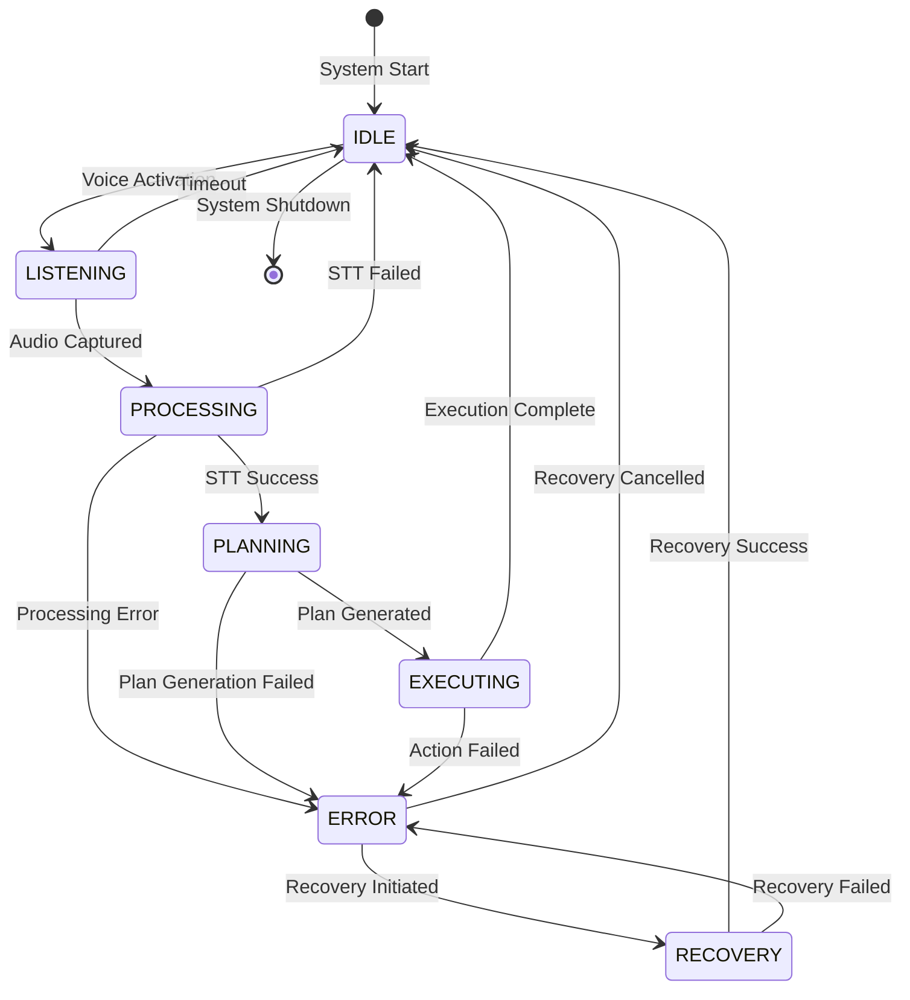

# Autonomy State Machine

## Overview

The Autonomy State Machine is the core control system that manages the operational states of the Vision-Language-Action (VLA) system. It provides a structured approach to handling different phases of robot operation, from initial command reception to task completion, with robust error handling and recovery mechanisms.

## State Definitions

The VLA system operates in one of the following seven distinct states:

### 1. IDLE State
- **Description**: Awaiting voice command
- **Entry Conditions**: System initialization or completion of a task
- **Exit Conditions**: Voice activation detected
- **Activities**: Listening for activation phrase, maintaining system readiness
- **Transitions**: IDLE → LISTENING

### 2. LISTENING State
- **Description**: Capturing audio input
- **Entry Conditions**: Voice activation detected
- **Exit Conditions**: Audio capture complete or timeout
- **Activities**: Recording audio, waiting for complete command
- **Transitions**: LISTENING → PROCESSING or LISTENING → IDLE

### 3. PROCESSING State
- **Description**: Converting speech to text
- **Entry Conditions**: Audio capture complete
- **Exit Conditions**: Speech-to-text successful or failed
- **Activities**: STT processing, confidence scoring
- **Transitions**: PROCESSING → PLANNING or PROCESSING → IDLE or PROCESSING → ERROR

### 4. PLANNING State
- **Description**: Generating action sequence from LLM
- **Entry Conditions**: Speech-to-text successful
- **Exit Conditions**: Action plan generated or generation failed
- **Activities**: LLM processing, action validation, safety checks
- **Transitions**: PLANNING → EXECUTING or PLANNING → ERROR

### 5. EXECUTING State
- **Description**: Running action sequence in simulation
- **Entry Conditions**: Action plan validated and ready for execution
- **Exit Conditions**: Execution complete or action failed
- **Activities**: Action dispatch, progress monitoring, feedback collection
- **Transitions**: EXECUTING → IDLE or EXECUTING → ERROR

### 6. ERROR State
- **Description**: Error occurred, awaiting recovery decision
- **Entry Conditions**: Error in any state
- **Exit Conditions**: Recovery initiated or cancelled
- **Activities**: Error logging, recovery preparation, user notification
- **Transitions**: ERROR → RECOVERY or ERROR → IDLE

### 7. RECOVERY State
- **Description**: Attempting to recover from error
- **Entry Conditions**: Recovery initiated from ERROR state
- **Exit Conditions**: Recovery successful or failed
- **Activities**: Recovery execution, state reset, retry attempts
- **Transitions**: RECOVERY → IDLE or RECOVERY → ERROR

## State Machine Diagram

For visual representation of state transitions, see the [Autonomy State Machine Diagram](/module-4-assets/diagrams/autonomy-state-machine.svg).

## State Transition Logic

### Valid Transitions
The state machine enforces specific valid transitions to maintain system integrity:



### Transition Conditions
Each transition is governed by specific conditions:

- **Voice Activation**: Detection of activation phrase with sufficient confidence
- **Audio Captured**: Complete audio phrase recorded within timeout
- **STT Success**: Speech successfully converted to text with confidence > threshold
- **Plan Generated**: Valid action sequence created by LLM
- **Execution Complete**: All actions in sequence completed successfully
- **Action Failed**: Any action in sequence failed to execute
- **Recovery Initiated**: Recovery attempt within allowed attempts

## Implementation Details

### State Representation
```python
from enum import Enum

class VLAState(Enum):
    IDLE = "idle"
    LISTENING = "listening"
    PROCESSING = "processing"
    PLANNING = "planning"
    EXECUTING = "executing"
    ERROR = "error"
    RECOVERY = "recovery"
```

### State Management Class
```python
class VLAStateMachine:
    def __init__(self, config):
        self.config = config
        self.current_state = VLAState.IDLE
        self.active_plan_id = None
        self.last_error = None
        self.recovery_attempts = 0
        self.state_entry_time = time.time()

        # Define valid transitions
        self.valid_transitions = self._define_transitions()

    def _define_transitions(self):
        return {
            VLAState.IDLE: [VLAState.LISTENING, VLAState.ERROR],
            VLAState.LISTENING: [VLAState.PROCESSING, VLAState.IDLE],
            VLAState.PROCESSING: [VLAState.PLANNING, VLAState.IDLE, VLAState.ERROR],
            VLAState.PLANNING: [VLAState.EXECUTING, VLAState.ERROR],
            VLAState.EXECUTING: [VLAState.IDLE, VLAState.ERROR],
            VLAState.ERROR: [VLAState.RECOVERY, VLAState.IDLE],
            VLAState.RECOVERY: [VLAState.IDLE, VLAState.ERROR]
        }
```

## Error Handling and Recovery

### Error Types
The system handles various error types:

- **Recognition Errors**: STT failures, low confidence
- **Planning Errors**: LLM failures, invalid action plans
- **Execution Errors**: Action server failures, environmental constraints
- **Communication Errors**: ROS 2 communication issues
- **Resource Errors**: System resource limitations

### Recovery Mechanisms
The state machine implements several recovery strategies:

1. **State Reset**: Clear current state and return to known safe state
2. **Retry**: Attempt the same operation again
3. **Fallback**: Use alternative approach to achieve goal
4. **Abort**: Safely terminate operation and return to IDLE

### Recovery Configuration
```python
{
  "recovery": {
    "max_attempts": 3,
    "retry_delay": 2.0,
    "fallback_enabled": true,
    "state_reset_on_recovery": true
  }
}
```

## Monitoring and Logging

### State Transition Logging
All state transitions are logged for debugging and analysis:

```python
def transition_to(self, new_state, reason=""):
    if self.is_transition_valid(new_state):
        old_state = self.current_state
        self.current_state = new_state
        self.state_entry_time = time.time()

        # Log the transition
        log_entry = {
            'timestamp': time.time(),
            'from_state': old_state.value,
            'to_state': new_state.value,
            'reason': reason,
            'recovery_attempts': self.recovery_attempts
        }

        self.logger.info(f"State transition: {old_state.value} -> {new_state.value} ({reason})")
        self._publish_state_update(log_entry)

        return True
    return False
```

### Metrics Collection
The system collects metrics for each state:

- Time spent in each state
- Frequency of state transitions
- Error rates by state
- Recovery success rates
- Task completion rates

## Safety Considerations

### Safe State Transitions
The state machine enforces safety by:
- Validating all transitions before execution
- Preventing invalid state combinations
- Ensuring proper cleanup during transitions
- Maintaining system stability during errors

### Emergency Procedures
- Immediate transition to safe state on critical errors
- Graceful degradation when components fail
- Automatic recovery attempt within safe parameters
- User notification of safety-related transitions

## Performance Optimization

### State Transition Efficiency
- Minimal processing during state transitions
- Asynchronous operations where possible
- Efficient state representation
- Optimized transition validation

### Resource Management
- Proper cleanup of resources during state changes
- Memory management for state data
- Efficient communication during transitions
- Reduced overhead in frequently accessed states

## Integration with Other Components

### Voice Processing Integration
The state machine coordinates with voice processing:
- Transitions from IDLE to LISTENING on activation
- Transitions from LISTENING to PROCESSING on audio capture
- Error handling for recognition failures

### Action Execution Integration
The state machine manages action execution:
- Transitions to EXECUTING when plan is ready
- Monitors action progress during execution
- Handles action failures and recovery

### ROS 2 Integration
The state machine publishes state updates:
- State information published to `/vla/state` topic
- State changes trigger ROS 2 events
- State information available to other nodes

## Educational Applications

### Learning Objectives
The state machine demonstrates:
- Finite state machine design principles
- Error handling in autonomous systems
- State management in robotics
- Safety considerations in system design

### Hands-on Activities
Students can experiment with:
- State transition logic
- Error recovery strategies
- Performance optimization
- Safety constraint implementation
- State visualization and monitoring

## Configuration and Customization

### State Timers
Different states may have different timeout values:
- LISTENING: 10 seconds to complete command
- PROCESSING: 5 seconds for STT processing
- EXECUTING: Task-dependent execution time

### Custom States
The system can be extended with additional states:
- CALIBRATION: System calibration state
- LEARNING: Learning from demonstration state
- MAINTENANCE: System maintenance state

The Autonomy State Machine provides a robust foundation for managing the complex interactions required in Vision-Language-Action systems, ensuring safe and reliable operation while maintaining flexibility for various applications.