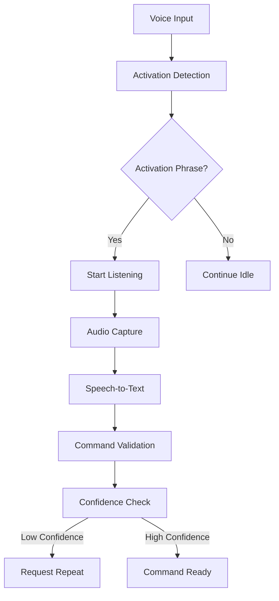
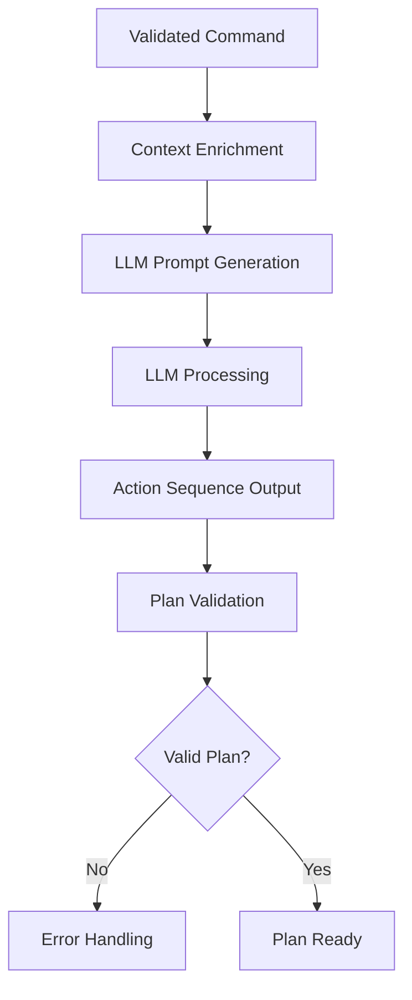
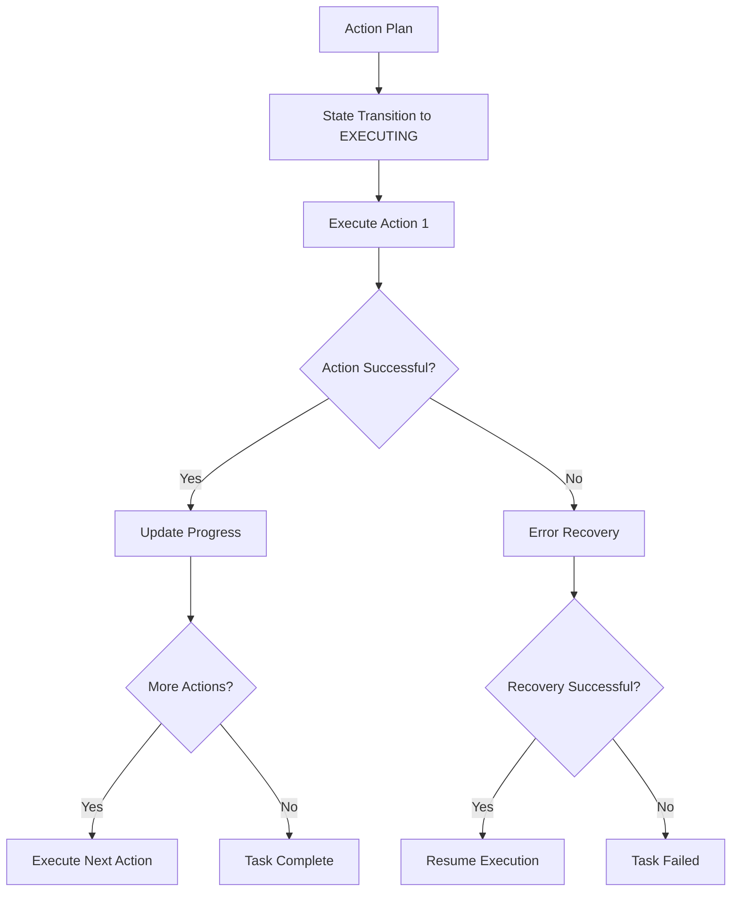

# Command-Plan-Action Flow

## Overview

The Command-Plan-Action flow represents the core pipeline of the Vision-Language-Action (VLA) system, transforming natural language commands into executable robot actions. This flow encompasses the complete journey from voice input to task completion, ensuring reliable and safe execution of user requests.

## Flow Architecture

The Command-Plan-Action flow consists of three primary stages:

1. **Command Processing**: Voice command recognition and validation
2. **Plan Generation**: Translation of natural language to action sequences
3. **Action Execution**: Execution of action sequences with monitoring and feedback

```
[Voice Command] → [Command Processing] → [Plan Generation] → [Action Execution] → [Task Completion]
```

## Stage 1: Command Processing

### Voice Activation and Recognition
The process begins when the system detects a voice command:



### Processing Steps
1. **Activation Detection**: System listens for activation phrase ("Hey Robot")
2. **Audio Capture**: Records the subsequent voice command
3. **Speech-to-Text**: Converts audio to text using STT engine
4. **Command Validation**: Ensures command meets quality and safety criteria
5. **Confidence Scoring**: Assigns confidence level to recognition

### Quality Assurance
- Confidence threshold validation (>0.5 by default)
- Noise filtering and audio preprocessing
- Command length and structure validation
- Safety filtering for inappropriate commands

## Stage 2: Plan Generation

### LLM Integration
The validated command is processed by the language model to generate an action plan:



### Generation Process
1. **Context Enrichment**: Adds environmental and robot capability information
2. **Prompt Engineering**: Creates structured prompt for LLM
3. **LLM Processing**: Generates action sequence using OpenAI API
4. **Plan Validation**: Ensures action sequence is executable
5. **Safety Filtering**: Applies guardrails to prevent unsafe actions

### Action Types
The system supports various action types:

- **Navigation**: `navigate_to_pose` with coordinates
- **Perception**: `detect_object` with object specifications
- **Manipulation**: `grasp_object`, `release_object` with parameters
- **Communication**: `speak` with text content
- **Timing**: `wait` with duration parameters

## Stage 3: Action Execution

### Execution Pipeline
The action plan is executed through a coordinated pipeline:



### Execution Steps
1. **State Management**: System transitions to EXECUTING state
2. **Action Dispatch**: Individual actions sent to appropriate ROS 2 servers
3. **Progress Monitoring**: Real-time tracking of execution status
4. **Feedback Collection**: Gathering results from action execution
5. **State Updates**: Updating system state based on execution results

### Monitoring and Feedback
- Real-time progress reporting
- Execution time tracking
- Error detection and handling
- Recovery attempt tracking

## Error Handling and Recovery

### Common Error Types
- **Recognition Errors**: Failed speech-to-text conversion
- **Planning Errors**: Failed LLM processing or invalid action plans
- **Execution Errors**: Failed action execution in simulation

### Recovery Strategies
1. **Retry**: Attempt the same action again
2. **Fallback**: Use alternative approach to achieve goal
3. **Replan**: Generate new action plan with different approach
4. **Abort**: Safely terminate task and return to safe state

## Performance Considerations

### Latency Targets
- **Voice Processing**: &lt;200ms for speech-to-text
- **Plan Generation**: &lt;3000ms for LLM processing
- **Action Execution**: Variable based on action complexity
- **Total Response**: &lt;10 seconds for simple commands

### Resource Optimization
- Asynchronous processing to minimize blocking
- Caching for frequently used commands
- Optimized LLM prompts for faster processing
- Efficient state machine transitions

## Safety and Validation

### Safety Checks
- Action validation against robot capabilities
- Environmental constraint checking
- Collision avoidance verification
- Force limitation enforcement

### Validation Process
1. **Pre-execution**: Validate action plan before execution
2. **During Execution**: Monitor for unexpected conditions
3. **Post-execution**: Verify task completion and system state
4. **Recovery Validation**: Ensure recovery actions are safe

## Diagram Reference

For visual representation of the flow, see the [Command-Plan-Action Flow Diagram](/module-4-assets/diagrams/command-plan-action-flow.svg).

## Implementation Details

### Configuration Parameters
The flow behavior can be configured through parameters:

```json
{
  "vla_system": {
    "confidence_threshold": 0.5,
    "response_timeout": 30,
    "max_recovery_attempts": 3,
    "latency_target": 200,
    "supported_actions": ["navigate_to_pose", "detect_object", "grasp_object", "release_object", "speak", "wait"]
  }
}
```

### Monitoring Metrics
- Command recognition accuracy
- Plan generation success rate
- Action execution success rate
- Average processing time per stage
- Error recovery success rate

## Educational Applications

### Learning Objectives
This flow demonstrates key concepts in robotics and AI:
- Natural language processing integration
- Multi-modal system design
- Real-time system architecture
- Error handling and recovery
- Human-robot interaction principles

### Hands-on Activities
Students can experiment with:
- Different LLM prompts and their effects
- Error recovery strategies
- Performance optimization techniques
- Safety constraint implementations